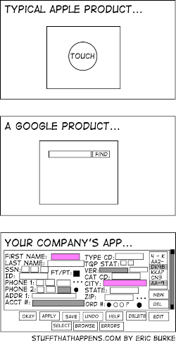

# Bad Habits

A> "Today, smoking is going to save lives"

## Growth Issues

In this chapter, I will show how projects usually grow and how developers solve the problems that arise. Let's start with a simple example:

```php
public function store(Request $request) 
{
    $this->validate($request, [
        'email' => 'required|email',
    ]);
    
    $user = User::create($request->all());
    
    if(!$user) {
        return redirect()->back()->withMessage('...');
    }
    
    return redirect()->route('users');
}

public function update($id, Request $request) 
{
    // same as in store()
}
```

This example is almost copied from the documentation, and it shows the power and elegance of Laravel. It's good that the framework provides excellent tools to solve common tasks. However, problems arise when you need to add features that don't fit into this elegant structure. They end up being patched together without considering the architecture. From the outside, it may look like a cute little house where one part is attached to another until it becomes an ugly mess.

The reason is that when faced with complex requirements, developers want to stay within the cozy confines of the tiny house, even when they clearly need something bigger. Let's see how this can happen in practice.

New requirements emerge for our application: adding avatar upload functionality and sending an email to the user after creation.

```php
public function store(Request $request) 
{
    $this->validate($request, [
        'email' => 'required|email',
        'avatar' => 'required|image',
    ]);
    
    $avatarFileName = ...;    
    \Storage::disk('s3')->put(
        $avatarFileName, $request->file('avatar'));
    
    $user = new User($request->except('avatar'));
    $user->avatarUrl = $avatarFileName;
    $user->save();
        
    \Email::send($user, 'Hi email');
    
    return redirect()->route('users');
}
```

Some logic must be duplicated in the **update** method, but for example, sending an email should only happen after creation. The code still looks fine, but the amount of duplicated code is growing. With three or four more additions like this, we end up with two quite large and nearly identical methods, **store** and **update**. Here's where a common mistake is made: to eliminate code duplication, a monstrous method is created with a name like **updateOrCreateUser**. This method requires a parameter to indicate whether it performs an "update" or "create" operation.

Immediately after extraction, the code looks decent, but as new requirements, especially different ones for creating and modifying entities, emerge, the developer realizes they've fallen into a trap. In one project, I saw a 700-line method with numerous `if($update)` statements:

```php
protected function updateOrCreateUser(..., bool $update)
{
    if ($update)...
    if ($update)...
    if (!$update)...
}
```

Bugs frequently occurred in such a mess, making them difficult to catch. The simple mistake here is that the developer extracted **different** logic that seemed similar into one method. The logic of creating or editing an entity may seem the same at first, but it will differ as the project evolves.

Now, I want to discuss naming language elements (variables, methods, and classes). If we try to name methods according to their meaning, much can be understood just by their names. **updateOrCreateUser** - the problem is evident without any analysis. **Or** is a clear sign of at least two different actions — two different logics. As the project evolves, these logics tend to diverge more and more, and it's completely counterproductive to keep them in one place.

Always name methods, classes, and variables according to their meaning. Sometimes, even the attempt to give them good names can lead to useful thoughts that help improve the design of your code.

In the case of almost identical **create** and **update** actions, better to leave each one in its method and find common logic inside each. For example, image uploads can be extracted into methods or classes with precise and understandable names. The result will be two methods with meaningful names and readable code, along with the bonus of extracted methods and classes that can likely be used in other application code parts.

## Extraction The Logic

A new requirement comes to the project: automatically check uploaded images for inappropriate content. Some developers might simply add this code to the **store** method and copy it to the **update** method. More experienced developers would extract this logic into a new controller method and call that method in both places. Even more experienced Laravel developers would find that the image upload code has become quite large and create a separate class, such as **ImageUploader**, which would handle image uploading and content validation.

```php
class ImageUploader
{
    /**
     * @returns bool|string 
     */
    public static function upload(UploadedFile $file) {...}
}
```

The **ImageUploader::upload** method returns **false** if the upload was unsuccessful, for example, due to an error with the cloud storage or inappropriate content. Upon successful upload, it returns the image's URL.

```php
public function store(Request $request) 
{
    ...
    $avatarFileName = ImageUploader::upload(
        $request->file('avatar')
    );
    
    if ($avatarFileName === false) {
        return %some_error%;
    }
    ...
}
```

The controller methods became simpler because the logic for uploading avatar images has been moved to another class. Excellent! The necessary class is already available if the project requires uploading other images. You just need to add a new parameter to the **upload** method, such as the folder where the images should be saved.

```php
public static function upload(UploadedFile $file, string $folder)
```

A new requirement: immediately ban the user who uploaded inappropriate content. It sounds weird, considering the imperfect accuracy of modern image analyzers, but it was an actual requirement on one of my projects!

```php
public static function upload(UploadedFile $file, string $folder)
{
    ...
    if (check failed) {
        $this->banUser(\Auth::user());
    }
    ...
}
```

Another requirement: do not ban the user if inappropriate content was uploaded to private locations.

```php
public static function upload(
    UploadedFile $file, 
    string $folder, 
    bool $dontBan = false)
```

When I say "new requirement", it doesn't necessarily mean it arises the next day. In large projects, months or even years can pass between these "new requirements." Other developers implementing them may not understand why the code was written a certain way. Their job is simply to implement the requirement in the code, preferably quickly. Even if they dislike a part of the code, estimating the time required for refactoring is difficult. Moreover, and more importantly, it's challenging for them to avoid breaking anything. This is quite a common problem.

Another requirement: the user's private locations should have less strict content validation rules.

```php
public static function upload(
    UploadedFile $file, 
    string $folder, 
    bool $dontBan = false,
    bool $weakerRules = false)
```

The final requirement for this example is that the application should not immediately ban users, only after several attempts to upload inappropriate content.

```php
public static function upload(
    UploadedFile $file, 
    string $folder, 
    bool $dontBan = false,
    bool $weakerRules = false,
    int $banThreshold = 5)
{
    //...
    if (check failed && !$dontBan) {
        if (\RateLimiter::tooManyAttempts(..., $banThreshold)) {
            $this->banUser(\Auth::user());
        }
    }
    //...
}
```

This code is not good anymore. The image upload function has a bunch of strange parameters related to content validation and user banning. If the user banning process changes, the developer has to open the **ImageUploader** class and make the changes there, which isn't logical. Reading the **upload** method call becomes more and more difficult:

```php
ImageUploader::upload(
    $request->file('avatar'), 'avatars', true, false
);
```

In newer versions of PHP, you can use named parameters, and the code may look like this:

```php
ImageUploader::upload(
    $request->file('avatar'), 
    folder: 'avatars', 
    dontBan: true, 
    weakerRules: false
);
```

This is much more readable, but it's just an attempt to hide the real problem. Any boolean parameter for a function indicates at least two different logics hidden inside it, and each additional boolean parameter increases that number, sometimes exponentially.

Such parameters almost always violate the Single Responsibility Principle. The **ImageUploader** class is now responsible for image uploading and a bunch of other things. It has other issues as well, but we will discuss them later.

## The "Simplicity" of REST

The RESTful approach of building an API is very popular. Laravel developers use resource controllers with ready-made methods like **store**, **update**, **delete**, etc., not only for API routes but also for web routes. It looks straightforward. Just four verbs: **GET** (read), **POST** (create), **PUT/PATCH** (update), and **DELETE** (delete).

It works well for projects that involve simple operations on entities—typical CRUD (Create, Read, Update, Delete) applications with forms for creation/editing and entity lists with a "Delete" button. However, when an application becomes more complex, the RESTful approach quickly becomes uncomfortable. For example, I googled the phrase "REST API ban user": the first three results with examples from different API documentation were significantly different.

```
PUT /api/users/banstatus
params:
UserID
IsBanned
Description
```

```
POST /api/users/ban userId reason

POST /api/users/un-ban userId
```

```
PUT /api/users/{id}/status
params:
status: guest, regular, banned, quarantine

There was also a huge table showing which statuses could be changed to which and what would happen in each case.
```

As you can see, any non-standard verb makes the RESTful approach unclear, especially for beginners. Usually, all verbs are implemented through the entity **update** method. When I asked during one of my seminars, "How would you implement user banning in your REST API?" the first answer was:

```
PUT /api/users/{id}
params:
IsBanned=true
```



I often recall the image of the "typical Apple product, typical Google product" as the best illustration of the problem. The problem is that developers, knowing that the result will eventually be a simple UPDATE SQL query to the table corresponding to the model, start implementing all these changes through that model's **update** method. In the image, we see the extreme manifestation of this habit, which has significantly impacted the user interface.

There's nothing simpler than writing `$model->update($request->all())`, but there are many consequences to this simplicity, and they are all bad. Later in this book, we'll come across a couple of them, but here I want to focus on the loss of control. When the code is under control at every point, it's clear what is happening and what logic is being executed. The code `$model->update($request->all())` tells us that we're simply updating a row in the database with the data from the HTTP request. For an application that provides nothing more than an interface to the database rows, it's perfectly fine because that's the task. However, even the simplest ones, entities tend to acquire some meaning, evolving from a simple set of table fields into objects with behavior. A user is not just a set of fields from the `users` table. They are objects representing something real that can be banned or unbanned. Even a blog post can be published or unpublished.

`$model->update($request->all())` no longer represents such an obvious action. Was a post published here? Was the user banned or not? We don't know! Control over the code is lost, and it's necessary. Once an entity acquires behavior, sooner or later, we'll want to react to that behavior. Sending an email or clearing the cache, for example. There are many attempts to regain control, but they fall into two categories: treating the cause and treating the consequences.

Here's an example of treating the consequences, which I often encounter in source code:

```php
function afterUserUpdate(User $user)
{
    if (!$user->getOriginal('isBanned') && $user->isBanned) {
        // Send a 'ban' email
    }
}
```

This code screams about a problem. The data has somehow changed (most likely through `$user->update($data)`), and here we're trying to understand what exactly happened. Try your best to avoid such situations. You need to treat the cause of the loss of control. If you need to ban a user, an explicit ban command is required—whether it's a method like `UserController::ban`, `$user->ban()`, or a `BanUserCommand` class. Inside it, it will always be clear what is actually happening with the entity. This is important.

## PHP dark magic 

Sometimes developers don't see (or choose not to) the simple way of implementing something. They write code with reflection, magic methods, or other dynamic features of the PHP language. This code is hard to write and will be much harder to read. I have often fallen into this trap, like every developer, I suppose.

Let me show you a fun example. I wrote a simple class for working with cache keys in one of my projects. Cache keys are needed at least in two places: reading from the cache and deleting values before expiration. The obvious solution is: 

```php
final class CacheKeys
{
    public static function getUserByIdKey(int $id)
    {
        return sprintf('user_%d_%d', $id, User::VERSION);
    }
    
    public static function getUserByEmailKey(string $email)
    {
        return sprintf('user_email_%s_%d', 
            $email, 
            User::VERSION);
    }
    //...
}

$key = CacheKeys::getUserByIdKey($id);
```

This is a simple class with several typical methods that simply generate string keys for the cache. 
Do you remember the dogma "Do not use static functions!"? It is almost always true, but this is a good example of an exception. We will discuss this in the **Dependency Injection** chapter.
I showed this class to another developer when he had the same need and told him he could use a similar implementation. However, after some time, he said that my class "is not very elegant" and showed me his version:

```php
/**
 * @method static string getUserByIdKey(int $id)
 * @method static string getUserByEmailKey(string $email)
 */
class CacheKeys
{
    const USER_BY_ID = 'user_%d';
    const USER_BY_EMAIL = 'user_email_%s';
        
    public static function __callStatic(
        string $name, array $arguments)
    {
        $cacheString = static::getCacheKeyString($name);
        return call_user_func_array('sprintf', 
            array_prepend($arguments, $cacheString));
    }

    protected static function getCacheKeyString(string $input)
    {
        return constant('static::' . static::getConstName($input));
    }

    protected static function getConstName(string $input)
    {
        return strtoupper(
            static::fromCamelCase(
                substr($input, 3, strlen($input) - 6))
        );
    }

    protected static function fromCamelCase(string $input)
    {
        preg_match_all('<huge regexp>', $input, $matches);
        $ret = $matches[0];
        foreach ($ret as &$match) {
            $match = $match == strtoupper($match) 
                ? strtolower($match) 
                : lcfirst($match);
        }
        return implode('_', $ret);
    }
}

$key = CacheKeys::getUserById($id);
```

This code transforms strings like "getUserById" into "USER_BY_ID" and uses the value of a constant with that name to form cache keys. Many developers, especially younger ones, love to write such "beautiful" code. Sometimes this code allows saving a few lines of code, sometimes not. However, it will always be extremely difficult to debug and maintain. A developer should think ten times before using such "cool" language features.

## "Rapid" Application Development

Some framework developers also enjoy dynamic capabilities and implement similar "magic." It helps to implement simple small projects quickly. Still, by using such magic, developers lose control over the execution of the application code, and as the project grows, this becomes a problem. In the previous example, the use of `*::VERSION` constants was overlooked because using such magic makes it challenging to change the logic.

Here's another example. Laravel applications often contain a lot of similar code:
```php
class UserController
{
    public function update($id)
    {
        $user = User::find($id);
        if ($user === null) {
            abort(404);
        }
        // logic with $user
    }
}
```
Laravel offers to use "implicit route binding." This code works the same way as the previous one:

```php
// in the route file
Route::post('api/users/{user}', 'UserController@update');

class UserController
{
    public function update(User $user)
    {        
        // logic with $user
    }
}
```

This does indeed look nicer and eliminates some duplicated code. But here, we lose control over the code again. Looking at this code, we don't know exactly how the User entity was fetched. In most cases, this doesn't cause any problems, and, in fact, if the specific method doesn't care where the entity came from (for example, it simply shows the user's email), that's even good. But there can be other cases.

After some time, when the project grows a bit, developers start implementing caching. The problem is that caching can be applied to read (GET) requests but not to write (POST) requests. You can learn more about this in the **CQRS** chapter. Separating read and write operations becomes much more significant if the project starts using different databases for reading and writing (which happens quite often in high-load projects). Laravel allows configuring such work with databases quite easily. By continuing to use the framework's features, we would have to switch from "implicit route binding" to "explicit route binding" and implement it like this:

```php
Route::bind('user', function ($id) {
    // get and return the cached user or abort(404)
});

Route::bind('userToWrite', function ($id) {
    return App\User::onWriteConnection()->find($id) ?? abort(404);
});

Route::get('api/users/{user}', 'UserController@edit');
Route::post('api/users/{userToWrite}', 'UserController@update');
```

This code looks very strange and quickly leads to mistakes. It happened because we're treating the consequences rather than the cause. Instead of explicitly requesting the entity by its ID, developers used an implicit "optimization" and lost control over their code. Attempts to regain control only worsen the situation.

Do you notice the same pattern? The developer makes an awful decision that seems successful at first. As the project becomes more complex, this decision complicates things more and more. Instead of gathering the will to admit that the decision was terrible, the developer doesn't fix it but only fixes its consequences, making the code worse and worse. One of the main skills of a developer is having that sixth sense, where you start to realize that your code "resists" changes—it doesn't want to change easily and smoothly but requires more and more effort, patches, and compromises with your conscience to implement those changes. When you sense such resistance, you need to find its causes, identify those terrible design decisions, and fix them. This will make the project much more adaptable to future changes. This sixth sense allows large projects to remain afloat for a long time without becoming the "legacy" we all try to avoid when hiring.

Frameworks offer many opportunities to lose control over your code. You need to be very careful with them. As a small conclusion, I can say the following: the less "magic" is in the code, the easier it is to read and maintain. In rare cases, such as implementing an ORM library, it's okay to use magic, but only in those cases, and even then, it's not advisable to get carried away.

The initial code could be shortened without using route binding:

```php
class UserController
{
    public function update($id)
    {
        $user = User::findOrFail($id);
        //...
    }
}
```

There is no point in "optimizing" this one line of code. In the future, you can explicitly separate the queries when implementing caching. 

## Premature Optimization

Sometimes a developer may have the idea to prepare the code for future changes, for example, by predefining the places where data needs to be cached and separating them into separate classes/methods. They may even implement caching right away, even if the project doesn't require it at the moment. The developer is betting that the project will encounter specific problems and tries to prepare the code in advance. The "problem" could be the project's readiness for heavy loads or certain code changes (the central theme of this book). The bet is the additional time the developer or the whole team will need to invest in implementing this preparation. If the project encounters these problems in the future, the bet will be justified, as fixing the code later would require much more time.

The problem is that predicting problems is rarely successful. When developing their next service, experienced developers from FAANG-like companies probably know where they will encounter scalability problems. They can accurately predict those points, saving time by optimizing in advance. In most cases, attempts to optimize the application prematurely are simply a waste of valuable time.

Do not apply architectural solutions from the later chapters of this book to simple applications. It will be a significant expenditure with negative benefits. Do not implement caching or other architectural solutions to handle future loads for a project with less than 90 percent certainty about the nature and type of future loads. This will also be a waste of time and will likely introduce bugs—invalidating the cache is called one of the main problems in software development for a reason. In short, don't engage in premature optimization.

## Saving LOC

When I was studying programming at university, we used to show each other examples of super short code. Usually, it was a one-liner that implemented some algorithm. If the author of that line tried to understand it after a few days, it might take a few minutes, but it was still considered "cool" code.

In industrial development, code coolness is valued much less than readability. Code should be understandable to any other programmer with minimal cognitive effort. The shortest code is not always the most readable. Don't try to save bytes at the expense of code cleanliness and clarity. Usually, several simple classes are much better than one complex class, and this applies to all language elements (methods, modules, etc.).

Here's another example from one of my projects:

```php
public function userBlockage(
    UserBlockageRequest $request, $userId)
{
   /** @var User $user */
   $user = User::findOrFail($userId);

   $done = $user->getIsBlocked()
       ? $user->unblock()
       : $user->block($request->get('reason'));

   return response()->json([
       'status'  => $done,
       'blocked' => $user->getIsBlocked()
   ]);
}
```

The developer wanted to save a couple of code lines and implemented user blocking and unblocking in a single method. The problems started with the naming of this method. The weird noun "blockage" instead of the natural verbs "block" and "unblock." Whenever you find it difficult to name a software object (class, method), it indicates a problem! Besides the obvious logic violation — a strange dual action in a single method, there is also a problem with concurrency. When two moderators simultaneously want to block the same user, one will block, and the other will unblock them.

Different methods for blocking and unblocking would be a much more logical solution. More lines of code, but much less ambiguity and other problems.

## Other Sources of Pain

I forgot to mention the main enemy: Copy-Paste Driven Development.

Simply copying logic to where it is needed is productive in the short term. You don't have to worry about extracting that logic into a separate class or method and including it in each place. But the universe will respond quickly and painfully—no one can effectively maintain the same logic duplicated in multiple places.

Duplicated logic also has the opposite problem. Sometimes, although quite rarely, the logic may be the same in each line but different in meaning. Here, the temptation to extract this logic into one method or class is even greater than with create and update. In the future, these parts of the code can become different due to changing requirements, but developers often fall into the trap of trying to eliminate this "duplication" in advance. The advice is straightforward—duplicated logic is the logic that will **always** change uniformly with changing requirements. But we will talk more about this in the next chapter.