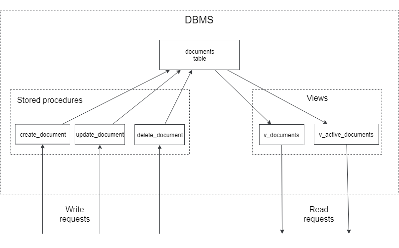
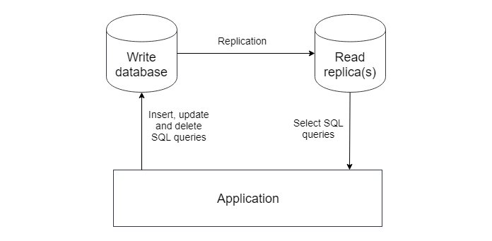
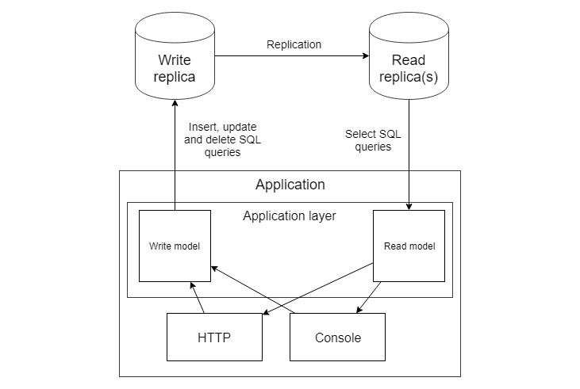

# CQRS

## Different nature of data reading and writing

As we discovered in the previous chapter, getters are unnecessary for implementing a correct domain model. Entities and methods that change their states are quite a sufficient set. However, data needs to be displayed somewhere. Is there no other way than creating getter methods? Let's try to "invent" something, and for that, I need to recall the past.

### Stored procedures and views

The first project in my professional career was a huge application with logic stored in the database in thousands of stored procedures and views. I wrote a client for all of this in C++. A view in a database is a saved SQL select query that looks like a table. This "table" should only be used for reading.

```sql
CREATE TABLE t (qty INT, price INT);
INSERT INTO t VALUES(3, 50);
CREATE VIEW v AS SELECT qty, price, qty*price AS value FROM t;
SELECT * FROM v;
+------+-------+-------+
| qty  | price | value |
+------+-------+-------+
|    3 |    50 |   150 |
+------+-------+-------+
```

An example of a view from the MySQL documentation. It includes a `value` field, which is not in the real table.

A stored procedure is simply a set of instructions written in the procedural extension of the SQL language (**PL/SQL** in Oracle, **Transact-SQL** in MSSQL, etc.). It's like a PHP function that executes inside the database.

```sql
PROCEDURE raise_salary (
    emp_id NUMBER,
    amount NUMBER
  ) IS
BEGIN
  UPDATE employees
    SET salary = salary + amount
    WHERE employee_id = emp_id;
END;
```

An example of the simplest procedure in **PL/SQL**. As I've mentioned before, the system was huge, with an incredible amount of logic. Without any restrictions, such systems quickly turn into a monstrous, unsupportable piece of... code. For each entity there, a specific structure of procedures and views was defined:





Tables there were like private fields of a class: they couldn't be touched directly. The application could only call stored procedures and make select queries from views. When I was writing this book, I realized that all these stored procedures and views constituted the Application Layer. Just as the Application layer described in the previous chapters hides the database from its clients (HTTP, Console, etc.), these stored procedures and views hide the real data table from their clients.

I remembered all this because it vividly shows how different the write operations that change data (stored procedures) are from the read operations needed to display data to users (views). They use completely different types of database objects.

### Master-slave replication

When an application suddenly becomes popular, and the load increases, the first thing developers usually do to reduce the load on the database is to use one database for write operations and one (or several others) for read operations. This schema is called master-slave replication.





All changes go to the **master** database and are replicated to the **slave** databases, called replicas. The same principle applies: write requests go to one place and read requests to another.

Sometimes, the replication process lags a bit for various reasons, and read replicas contain slightly outdated data. Users might change some data in the application but continue to see old data. By the way, the same thing happens when caching in the application is not implemented very carefully. In general, the architecture of a system with a single database and cache is very similar to the architecture of applications with master-slave replication. Here, the cache acts as a read replica, manually updated from the application, not automatically.

However, any replication issues remain behind, and replicas will always catch up with the master. The cache will expire, and old data will be replaced with new ones. If a user has changed some data, they will see the result, if not immediately, then a little later. This type of consistency is called eventual consistency. It's a typical attribute of any system with different stores for writing and reading.

Developers should always keep this fact in mind. If a write operation is performed, all requests, including select queries, should go to the write database — no values from replicas or cache. Otherwise, the database could be updated using outdated values. This condition forces the application layer to be divided into two parts: code for read operations and code for write operations.





But this isn't the only reason for such separation.

## A typical service class

```php
final class PostService
{
    // read methods
    public function getById($id): Post{}
    public function getLatestPosts(): array{}
    public function getAuthorPosts($authorId): array{}
    
    // write methods
    public function create(PostCreateDto $dto){}
    public function publish($postId){}
    public function delete($postId){}
}
```

A typical service class for a simple entity consists of methods for read and write operations. Manipulations and refactoring of this class are complicated.

Let's try to implement caching. If implemented directly in this class, it would have at least two responsibilities: working with the database and caching. The simplest solution is the Decorator pattern, which I've already applied in the dependency injection chapter. The problem is that all this is unnecessary for write methods: caching only makes sense for read operations. This fact also helps realize that read and write operations should be separated from each other.

Let's try to leave only write operations in **PostService**:

```php
final class PostService
{
    public function create(PostCreateDto $dto){}
    public function publish($postId){}
    public function delete($postId){}
}

interface PostQueries
{
    public function getById($id): Post;
    public function getLatestPosts(): array;
    public function getAuthorPosts($authorId): array;
}

final class DatabasePostQueries implements PostQueries{}

final class CachedPostQueries implements PostQueries
{
    public function __construct(
        private PostQueries $baseQueries,
        private Cache $cache,
    ) {}
    
    public function getById($id): Post
    {
        return $this->cache->remember('post_' . $id, 
            function() use($id) {
                return $this->baseQueries->getById($id);
            });
    }
    //...
}
```

It looks good! Separating read and write operations makes refactoring and other manipulations much easier, which suggests that this action pleases the gods.

### Reports

SQL queries for reports very easily show the difference in the nature of read and write requests. Report queries usually contain complex groupings, aggregations, and computed fields. It looks horrible when developers try to request these data using Eloquent entities. Eloquent entities are not meant to contain aggregated values and build such queries.

The simple idea of using **Structured Query Language** (**SQL**) quickly comes to mind. SQL queries are much more convenient for this purpose. Data from these queries can be stored in simple classes, such as DTOs, or just in arrays. This is another example of using absolutely different models for the same data.

## Command Query Responsibility Segregation

The **Command Query Responsibility Segregation** (CQRS) pattern suggests separating the code into read and write models completely. A model here is a set of classes working with the database: service classes, entities, value objects, etc.

Read and write models, being completely separated, can be implemented on entirely different technologies. The write model with Doctrine, and the read model with Eloquent, or even just pure SQL queries and simple DTO-style classes. Technologies and architecture for each model are chosen based on the project's needs, without regard to the other model.

For the application from the previous chapter, with the write model implemented using Doctrine, the read model could be implemented using Eloquent:

```php

namespace App\ReadModels;

use Illuminate\Database\Eloquent\Builder;
use Illuminate\Database\Eloquent\Model;

abstract class ReadModel extends Model
{
    public $incrementing = false;
        
    protected function performInsert(Builder $query)
    {
        throw new WriteOperationIsNotAllowedForReadModel();
    }

    protected function performUpdate(Builder $query)
    {
        throw new WriteOperationIsNotAllowedForReadModel();
    }

    protected function performDeleteOnModel()
    {
        throw new WriteOperationIsNotAllowedForReadModel();
    }

    public function truncate()
    {
        throw new WriteOperationIsNotAllowedForReadModel();
    }
}

final class WriteOperationIsNotAllowedForReadModel 
    extends \RuntimeException
{
    public function __construct()
    {
        parent::__construct(
            "Write operations isn't allowed");
    }
}
```

A base class for Eloquent models, which are used only for reading. All operations that write to the database are overridden with exception generation to eliminate even the theoretical possibility of writing data using these classes.

```php
final class Client extends ReadModel{}

final class Freelancer extends ReadModel{}

final class Proposal extends ReadModel{}

final class Job extends ReadModel
{
    public function proposals()
    {
        return $this->hasMany(Proposal::class, 'job_id', 'id');
    }
}

final class ClientsController extends Controller
{
    public function index()
    {
        return Client::query()->paginate(20);
    }
    
    public function show(UuidInterface $id)
    {
        return Client::findOrFail($id);
    }
}

final class FreelancersController extends Controller
{
    public function show(UuidInterface $id)
    {
        return Freelancer::findOrFail($id);
    }
}
```

The simplest implementation involves just entities being directly queried from the controllers. As you can see, even with a complex write model, some read models can be elementary, and it makes no sense to construct any complex architectures and layers for them. If needed, you can implement some ***Query** classes with caching decorators and other patterns. A huge bonus is that the write model won't even be affected!

Cases with a simple write model but a complex read model are also possible. I once participated in a high-load content project. The write model wasn't particularly complex, and it was implemented simply as an application layer with Eloquent entities. The read model, on the other hand, contained many complex queries, caching, etc. Simple SQL queries and plain classes with public fields were used as read entities.

## A few words at the end of the chapter

Like any pattern, CQRS has its advantages and disadvantages. It allows the development of read and write models independently of each other. It can reduce the complexity of the write model (remove getters and other logic used only for reading) and the read model (use the simplest entities and pure SQL queries). On the other hand, for most applications, this will mean duplicating entities, parts of the application layer, etc. Obviously, creating two models of the same thing is almost always more expensive than creating one.

Read and write models often require synchronization, and a task like "add a field to an entity" splits into two sub-tasks: do it for the read and write models. Everything has its price. And once again, this turns into virtual scales in the architect's head. Here, I just slightly described the weights on the scales.