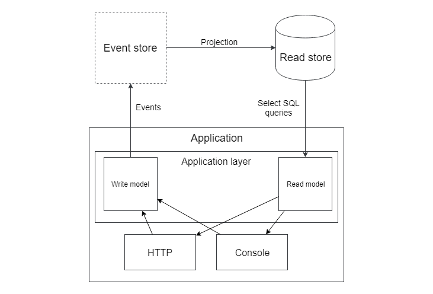

# Event sourcing

A> 1. e4 - e5
A>
A> 2. Kf3 - Kc6
A>
A> 3. Bb5 - a6

Have you played chess? Even if not, you're familiar with the game. Two players just move pieces on the board. And it's the best example of the pattern I want to write about.

## The game of kings

When chess enthusiasts want to learn about a game played by grandmasters, the final position on the board is of little interest to them. They want to know every move!

1. d4 - Nf6
2. Bg5

"What a joke from the world champion!!!"

The meaning of the current position on the board entirely depends on the moves made earlier:

1. The most important: who moves next? The position can simultaneously be winning or losing, depending on this.
2. Castling is only possible if both the king and the rook have not moved before.
3. En-passant capture is only possible immediately after a pawn makes a move passing through a square.

Let's create a chess-playing application. How will it store games? I see two options:

1. Store the current position on the board (i.e., where each piece is) with some additional information: who moves next, what castlings are possible, and some information about the last move to calculate the possibility of the en-passant capture. All moves made will be stored in a separate table for history.
2. Store only the moves made and replay them each time to get the current position.

As a mirror reflection of these ideas, in the chess world, there are two main notations:

**FEN** - stores the current position on the board with all the necessary additional information. Example:

```
rnbqkbnr/pp1ppppp/8/2p5/4P3/8/PPPP1PPP/RNBQKBNR w KQkq c6 0 2
```

**PGN** - just stores all moves. Example:

```
[Event "F/S Return Match"]
[Site "Belgrade, Serbia JUG"]
[Date "1992.11.04"]
[Round "29"]
[White "Fischer, Robert J."]
[Black "Spassky, Boris V."]
[Result "1/2-1/2"]

1. e4 e5 2. Nf3 Nc6 3. Bb5 a6
...(all other moves)...
42. g4 Bd3 43. Re6 1/2-1/2
```

As you can see, both ideas are widely represented in the chess world. The first way is traditional for web applications: we almost always store the current state in the database. Sometimes, there are also tables where the history of record changes is stored, but these data are always secondary: they're just some audit logs.

Storing only changes without the current state seems strange at first glance. Replaying all changes of an entity every time to get its current state is very slow, but having the complete history of the game can be very useful.

Let's imagine two chess-playing applications and analyze both ways. The first application will store chess games in a table like this:

```
id, current board position, who's turn it is, castling possibilities, field for en passant if it exists.
```

The second application will store all moves made from the beginning of the game.

Application requirements constantly change; here, I purposefully forgot a couple of chess rules about a draw. The "50-move rule" states that a draw should be declared if each side has made 50 moves without any pawn movement or capture. This rule is added to avoid endless games, and a draw is declared automatically in computer chess. How will our two applications implement this rule?

The first application would need to add a new field to the table: how many moves have been made without captures and pawn movement. It would be calculated after each move. There remains only the problem with those games that are currently ongoing, where this field has not yet been counted, and they would have to be left without this rule. The issue is, if we take some important entities from financial or insurance areas instead of chess, no one will allow us to leave old entities without new "rules" because these rules might be laws or important financial indicators.

The second application would just add this logic to its algorithms, and this rule would immediately start working for all games, including current ones.

The second system seems much more ready for changes, but if you're still in doubt, here's another rule about draws: threefold repetition. A draw is declared if the position on the board has been repeated three times during the game. I don't know how the developers of the first application will implement this requirement: they would have to store all previous board positions somewhere. I often observe such a picture: the wrong option for data storage, algorithm, or other architectural decisions is chosen, and every requirement change causes pain. The code "resists" changes strongly. Hacks and patches come into play. When this happens, it's worth taking a step back and trying to look at the system differently, questioning every architectural decision made earlier. It's probably not too late to change it.

The second application would again just add this rule to its logic, and nothing in the party storage system would have to be changed. As you can see, in some domains, knowing what happened previously is very important for the business logic, and the idea of storing an entity's entire history as an active participant in the logic, not as passive logs, can be quite sound.

However, such an application is still difficult to imagine: history is important for logic, but users are usually only interested in the current state of entities. Calculating the final state for every read request in a popular application could significantly impact performance. To solve this problem, you can use ideas from the previous chapter. We talked about completely separated code for write and read operations there. Here, the data stores will also be different.

For write operations, a store with tables that keep the entire history of entities will be used (there are also special stores optimized for event storage - you can google "Event store"). For read operations, a traditional store with tables storing the current state will be used. After each move made, the current state can be calculated and written to a table that will be used for read operations.

I chose chess because it's the best example of a true Event Sourcing domain. The Event Sourcing pattern suggests storing all changes in the system as a sequence of events. That is, instead of a traditional **posts** table:

```
PostId, Title, Text, Published, CreatedBy
```

Everything will be stored in a **post_events** table, into which you can only insert new records or read them, i.e., no update or delete queries - the history cannot be changed. It will look something like this:

```
PostId, EventName, EventDate, EventData
```

Possible events:

* **PostCreated**(Title, Text, CreatedBy)
* **PostPublished**(PublishedBy)
* **PostDeleted**

Of course, a blog is definitely not the domain where implementing the Event Sourcing pattern makes sense. It's tough to imagine such logic for blog posts that would depend on their history. Storing data as a sequence of events has advantages such as:

* Developers can "debug" any entity and understand how it came to its current state.
* The entire application's state can be calculated at any moment to see how everything was at that point.
* Any state based on historical events can be calculated for any entity, including old ones. For example, if the 'created_at' and 'updated_at' fields were forgotten - they can always be calculated for all entities later.
* Any logic that depends on an entity's history can be implemented, and it will work immediately for all entities — even those created before this logic was conceived. For example, a task tracker requirement is that if a task has been assigned to the same user three times, the manager should be subscribed to this task.

There are some industries where the current state of entities is not the only essential data:

* The balance of your bank account is always calculated as a result of all transactions with that account, which the bank stores as the primary data source.
* Insurance company calculations are entirely based on history.
* Medical records are always just some entries from history.
* Accounting software works exclusively with events that have occurred.

Real examples of technologies using the Event Sourcing approach include modern code storage systems (git) and blockchain.

Git stores data as sequences of changes. A change set, often called a commit, contains events like "file A created with this content", "certain lines inserted into the content of file B at a specific position", "file C deleted".

Blockchain refers to a sequence of information blocks that can only be added to, and each block contains a cryptographic hash calculated from the previous block.

Databases store all operations that change data (insert, update, and delete queries) in a special transaction log, and in some situations, it's used as the main source of data. The replication process is usually based on transferring this transaction log from the master database to replicas.

## Unit-testing entities

Let's review the unit tests for the model in the Domain Layer chapter.

```php
class JobApplyTest extends UnitTestCase
{
    public function testApplySameFreelancer()
    {
        $job = $this->createJob();
        $freelancer = $this->createFreelancer();

        $freelancer->apply($job, 'cover letter');

        $this->expectException(SameFreelancerProposalException::class);

        $freelancer->apply($job, 'another cover letter');
    }
}
```

Instead of creating an entity in the desired state and testing its behavior in that state, tests are forced to create the entity in its initial state and, by executing some commands, bring it to the required condition. This test repeats the ideas of Event Sourcing.

Events are the only information these models give out, and unit tests can only check them. What if an entity returns an event about a successful action but forgets to update its state? The test for this action will be successful. If the entity is well covered by tests, some other tests will likely fail. If the **Job** entity doesn't add an application, then the **testApplySameFreelancer** test will fail. However, for complex entities (remember Monopoly and chess?), such tests may not be found, and the entity with incorrect logic will pass all unit tests. Here's a simple example of publishing articles:

```php
class Post
{
    public function publish()
    {        
        if (empty($this->body)) {
            throw new CantPublishException();
        }

        //$this->published = true;
        
        $this->record(new PostPublished($this->id));
    }
}

class PublishPostTest extends \PHPUnit\Framework\TestCase
{
    public function testSuccessfulPublish()
    {
        // initialize
        $post = new Post('title', 'body');

        // run
        $post->publish();

        // check
        $this->assertEventsHas(
            PostPublished::class, $post->releaseEvents());
    }
}
```

The tests will be "green", but the field in the database will not be updated. The post will not be published, and functional tests, if written, should fail, but relying on other tests is not the best strategy. In Event Sourcing (ES) systems, events are the primary source of data, so the PostPublished event is essentially equivalent to the record `$this->published = true;`. Unit tests for ES entities look much more natural. Tests check actual behavior.

## A world without magic

How are entities from the Domain Layer chapter saved in the database? The entity classes hide almost all information about themselves, with private fields and public methods only for actions that change state. Doctrine analyzes entity files, getting meta-information about how fields should be saved and in which tables. After **persist** and **flush** commands, it uses all the power of dark PHP reflection magic, getting necessary values and saving them in the database. What if magic left our sinful world? In such a world, Doctrine entities would be impossible.

Developers might try to forget about **Information Hiding** and make all the internals of entities public, or just implement the Event Sourcing pattern! Events are public and fully open. They can be easily saved in the database. As a consequence, the infrastructure part of ES-systems code is several orders of magnitude simpler than Doctrine-based systems.





The architecture of ES (Event Sourcing) systems mirrors the schema of CQRS applications, but the differences between read and write models also extend to the storage. The write model, instead of data that could be used in the read model, stores events, and the read data are just projections of these events:

- Traditional current state of entities in tables
- Full-text indexes for search (SphinxSearch or Elasticsearch)
- Special statistical tables for reports (they are often stored in separate tables or databases, even in traditional systems)
- There can be other data for reading as well

Events are a reliable source of data for all applications. Storing them as the primary data source is a good idea, but everything has its price.

## Implementing ES

At the time of writing the book, the best PHP library for implementing an ES approach was **prooph/event-sourcing**, but recently I came across a statement from one of the developers (full version - https://www.sasaprolic.com/2018/08/the-future-of-prooph-components.html), where he explains why they decided to stop further development of this library. I mentioned that this approach practically does not require complex magic with reflection. The developer directly writes that using any library to implement the ES approach is wrong because writing those few lines of code for implementing the infrastructure part of the ES application will be beneficial both in terms of understanding ES by the project developers and in terms of reducing the project's dependencies on other libraries. However, this won't prevent me from examining an example of using this library, written by **prooph** developers themselves: **prooph/proophessor-do**.

Each entity has a Value object for its ID. It makes sense both to hide the actual type used for the key and to prevent accidentally trying to retrieve an entity using the ID of another entity in the code. This approach is also popular in Doctrine-like entities. 

```php
interface ValueObject
{
    public function sameValueAs(ValueObject $object): bool;
}

final class TodoId implements ValueObject
{
    private function __construct(private UuidInterface $uuid) {}

    public static function generate(): TodoId
    {
        return new self(Uuid::uuid4());
    }

    public static function fromString(string $todoId): TodoId
    {
        return new self(Uuid::fromString($todoId));
    }

    public function toString(): string
    {
        return $this->uuid->toString();
    }

    public function sameValueAs(ValueObject $other): bool
    {
        return \get_class($this) === \get_class($other) 
            && $this->uuid->equals($other->uuid);
    }
}
```
The **TodoId** class wraps the UUID value.

```php
final class TodoWasPosted extends AggregateChanged
{
    /** @var UserId */
    private $assigneeId;

    /** @var TodoId */
    private $todoId;

    /** @var TodoText */
    private $text;

    /** @var TodoStatus */
    private $todoStatus;

    public static function byUser(UserId $assigneeId, TodoText $text, 
        TodoId $todoId, TodoStatus $todoStatus): TodoWasPosted
    {
        /** @var self $event */
        $event = self::occur(...);

        $event->todoId = $todoId;
        $event->text = $text;
        $event->assigneeId = $assigneeId;
        $event->todoStatus = $todoStatus;

        return $event;
    }

    public function todoId(): TodoId {...}

    public function assigneeId(): UserId {...}

    public function text(): TodoText {...}

    public function todoStatus(): TodoStatus {...}
}
```

**TodoWasPosted** is an event that occurs when a Todo object is created. **AggregateChanged** is the base class for all ES events in **Prooph**. A named constructor makes the code read like a natural sentence in English: **TodoWasPosted::byUser(...)**. Everything, including the text and status, is wrapped in Value Object classes. The benefits of such information hiding were discussed in the chapter on the Domain Layer.

Every entity should inherit from the **AggregateRoot** class. Its main parts include:

```php
abstract class AggregateRoot
{
    /**
     * List of events that are not committed to the EventStore
     *
     * @var AggregateChanged[]
     */
    protected $recordedEvents = [];

    /**
     * Get pending events and reset stack
     *
     * @return AggregateChanged[]
     */
    protected function popRecordedEvents(): array
    {
        $pendingEvents = $this->recordedEvents;

        $this->recordedEvents = [];

        return $pendingEvents;
    }

    /**
     * Record an aggregate changed event
     */
    protected function recordThat(AggregateChanged $event): void
    {
        $this->version += 1;

        $this->recordedEvents[] = 
                        $event->withVersion($this->version);

        $this->apply($event);
    }

    abstract protected function aggregateId(): string;

    /**
     * Apply given event
     */
    abstract protected function apply(AggregateChanged $event);
}
```

The same pattern of storing events within the entity that we used earlier. The difference is only in the **apply** method. ES entities can change their state only by applying events. Each time, the entity restores its state by "replaying" all events that have occurred with it from the beginning.

```php
final class Todo extends AggregateRoot
{
    /** @var TodoId */
    private $todoId;

    /** @var UserId */
    private $assigneeId;

    /** @var TodoText */
    private $text;

    /** @var TodoStatus */
    private $status;

    public static function post(
        TodoText $text, 
        UserId $assigneeId, 
        TodoId $todoId): Todo
    {
        $self = new self();
        $self->recordThat(TodoWasPosted::byUser(
            $assigneeId, $text, $todoId, TodoStatus::OPEN()));

        return $self;
    }

    /**
     * @throws Exception\TodoNotOpen
     */
    public function markAsDone(): void
    {
        $status = TodoStatus::DONE();

        if (! $this->status->is(TodoStatus::OPEN())) {
            throw Exception\TodoNotOpen::triedStatus($status, $this);
        }

        $this->recordThat(TodoWasMarkedAsDone::fromStatus(
          $this->todoId, $this->status, $status, $this->assigneeId));
    }

    protected function aggregateId(): string
    {
        return $this->todoId->toString();
    }

    /**
     * Apply given event
     */
    protected function apply(AggregateChanged $event): void
    {
        switch (get_class($event)) {
            case TodoWasPosted::class:
                $this->todoId = $event->todoId();
                $this->assigneeId = $event->assigneeId();
                $this->text = $event->text();
                $this->status = $event->todoStatus();
                break;
            case TodoWasMarkedAsDone::class:
                $this->status = $event->newStatus();
                break;
        }
    }
}
```

This is a small part of the **Todo** entity. The main difference is that the entity's state depends entirely on events. The method **markAsDone** doesn't change the state directly, only through the **TodoWasMarkedAsDone** event.

The ID and all the events that have occurred with the entity since the last save are used to save it. They are saved in an event store (this can be just a table in a database or something else). The entity fetching contains
1. Fetching all events by ID.
2. Creating a new object of the required class.
3. "Replaying" all events through it.

```php
final class Todo extends AggregateRoot
{
    /** @var null|TodoDeadline */
    private $deadline;
    
    /**
     * @throws Exception\InvalidDeadline
     * @throws Exception\TodoNotOpen
     */
    public function addDeadline(
        UserId $userId, TodoDeadline $deadline)
    {
        if (! $this->assigneeId()->sameValueAs($userId)) {
            throw Exception\InvalidDeadline::userIsNotAssignee(
                $userId, $this->assigneeId());
        }
        
        if ($deadline->isInThePast()) {
            throw Exception\InvalidDeadline::deadlineInThePast(
                $deadline);
        }
        
        if ($this->status->is(TodoStatus::DONE())) {
            throw Exception\TodoNotOpen::triedToAddDeadline(
                $deadline, $this->status);
        }
        
        $this->recordThat(DeadlineWasAddedToTodo::byUserToDate(
            $this->todoId, $this->assigneeId, $deadline));
            
        if ($this->isMarkedAsExpired()) {
            $this->unmarkAsExpired();
        }
    }
}
```

Another part of the **Todo** entity is adding a deadline. Just read the code. It looks like simple English text, thanks to properly named constructors and value objects. The deadline is not just a **DateTime** but a special object **TodoDeadline** with all necessary helper methods, such as **isInThePast**. All this makes the client code very clean and easy to read, which is essential for large projects developed by a team of programmers.

I don't want to continue with this example, but I recommend checking it out yourself if interested - **https://github.com/prooph/proophessor-do**

Projections are objects that transform ES events into easy-to-read data. Almost every ES system has projections that build traditional tables containing the current state of entities.

```php
final class Table
{
    const TODO = 'read_todo';
    //...
}


final class TodoReadModel extends AbstractReadModel
{
    /**
     * @var Connection
     */
    private $connection;

    public function __construct(Connection $connection)
    {
        $this->connection = $connection;
    }

    public function init(): void
    {
        $tableName = Table::TODO;

        $sql = <<<EOT
CREATE TABLE `$tableName` (
`id` varchar(36) COLLATE utf8_unicode_ci NOT NULL,
`assignee_id` varchar(36) COLLATE utf8_unicode_ci NOT NULL,
`text` longtext COLLATE utf8_unicode_ci NOT NULL,
`status` varchar(7) COLLATE utf8_unicode_ci NOT NULL,
`deadline` varchar(30) COLLATE utf8_unicode_ci DEFAULT NULL,
`reminder` varchar(30) COLLATE utf8_unicode_ci DEFAULT NULL,
PRIMARY KEY (`id`),
KEY `idx_a_status` (`assignee_id`,`status`),
KEY `idx_status` (`status`)
) ENGINE=InnoDB DEFAULT CHARSET=utf8 COLLATE=utf8_unicode_ci;
EOT;

        $statement = $this->connection->prepare($sql);
        $statement->execute();
    }

    public function isInitialized(): bool
    {
        $tableName = Table::TODO;

        $sql = "SHOW TABLES LIKE '$tableName';";

        $statement = $this->connection->prepare($sql);
        $statement->execute();

        $result = $statement->fetch();

        if (false === $result) {
            return false;
        }

        return true;
    }

    public function reset(): void
    {
        $tableName = Table::TODO;

        $sql = "TRUNCATE TABLE `$tableName`;";

        $statement = $this->connection->prepare($sql);
        $statement->execute();
    }

    public function delete(): void
    {
        $tableName = Table::TODO;

        $sql = "DROP TABLE `$tableName`;";

        $statement = $this->connection->prepare($sql);
        $statement->execute();
    }

    protected function insert(array $data): void
    {
        $this->connection->insert(Table::TODO, $data);
    }

    protected function update(
        array $data, array $identifier): void
    {
        $this->connection->update(
            Table::TODO,
            $data,
            $identifier
        );
    }
}
```

This class represents a table for holding the current state of todo tasks. The methods **init**, **reset**, and **delete** are used when the system wants to create or recreate the projection. The methods **insert** and **update** are obviously for adding/changing records in the table. A similar class can be created for building full-text indexes, statistical data, or just for logging all events in a file (this is not the best use of projections - all events are already stored in the event store).

```php
$readModel = new TodoReadModel(
    $container->get('doctrine.connection.default'));

$projection = $projectionManager
    ->createReadModelProjection('todo', $readModel);

$projection
->fromStream('todo_stream')
->when([
    TodoWasPosted::class 
        => function ($state, TodoWasPosted $event) {
        $this->readModel()->stack('insert', [
            'id' => $event->todoId()->toString(),
            'assignee_id' => $event->assigneeId()->toString(),
            'text' => $event->text()->toString(),
            'status' => $event->todoStatus()->toString(),
        ]);
    },
    TodoWasMarkedAsDone::class 
        => function ($state, TodoWasMarkedAsDone $event) {
        $this->readModel()->stack(
            'update',
            [
                'status' => $event->newStatus()->toString(),
            ],
            [
                'id' => $event->todoId()->toString(),
            ]
        );
    },
    // ...
])
->run();
```

This is a projection configuration. It uses the **TodoReadModel** class and transforms events into commands for this class. The **TodoWasPosted** event creates a new record in the table. The **TodoWasMarkedAsDone** event changes the status field for a specific **id**. After transforming all events, the **read_todo** table will contain the current state of all tasks. The typical data handling process in an ES system is as follows:
Retrieve the entity from the event store.
Invoke a command (**markAsDone** or **addDeadline**).
Collect all new events from the entity (there could be more than one).
Save them in the event store.
Invoke all projections.
Some projections might be invoked immediately, especially those that change tables with the current state. Some can be executed later in a queue.

## A few words at the end of the chapter

The Event Sourcing pattern is very powerful. It allows easy implementation of logic based on historical data. It can help applications in regulated areas have the proper audit logs. It also helps applications be better prepared for changes, especially if those changes are based on what happened to entities in the past.

There are also plenty of downsides. ES is a "costly" approach. Costly in terms of coding time, hardware, and system administrator time required to maintain the project, as well as the level of developers needed. It will be harder for new team members to integrate. "Thinking in events" is significantly different from "thinking in database rows". By analyzing projects like **proophessor-do**, or creating your own, especially for non-standard domains, you can gain a deeper understanding of the advantages and disadvantages of this approach for each application and make a more informed decision on whether or not to choose it for new projects.