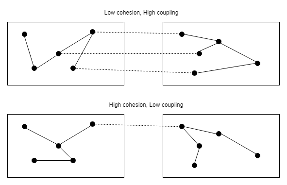
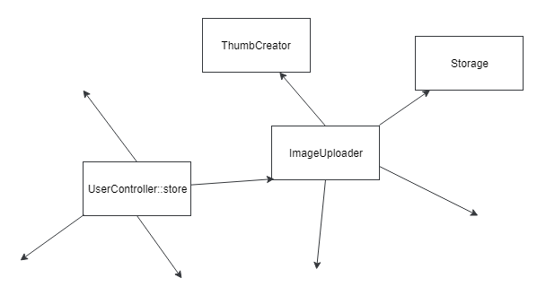
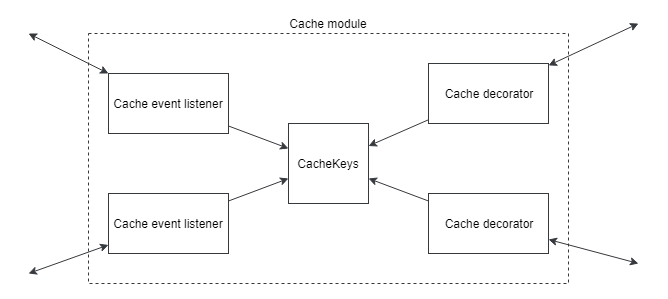

# Dependency Injection

A> "Give me a place to stand on, and I will move the Earth"

## Single Responsibility Principle

You may have heard of the Single Responsibility Principle (SRP). One of its definitions is, "Every module, class, or function should have responsibility over a single part of the functionality." Many developers simplify it to "a class should do one thing," but this definition is inaccurate. "One thing" can be a single line of code or an entire complex task. Drawing the boundaries here can be challenging.

Robert Martin proposed another definition by replacing the word "responsibility" with "reason for change": "A class should have one, and only one, reason to change." "Reason to change" is a more convenient term; we can start discussing architecture using it. Almost all patterns and practices aim to prepare an application for changes, but applications can vary with different requirements and possible changes.

I often hear statements like, "If you have all your code in controllers, you violate SRP!" Let's consider a simple application representing entity lists that can be created, modified, and deleted. It's called a CRUD application. All it does is provide an interface to the database rows without any additional logic.

```php
public function store(Request $request)
{
    $this->validate($request, [
        'email' => 'required|email',
        'name' => 'required',
    ]);
    
    $user = User::create($request->all());
    
    if (!$user) {
        return redirect()->back()->withMessage('...');
    }
    
    return redirect()->route('users');
}
```

What changes are possible in this app? Adding or removing fields/entities, cosmetic changes to the interface... It's hard to imagine anything more significant. I don't think this code violates SRP. Almost. The redirect algorithm could change, but it's a minor detail, and I don't see a reason to refactor this code.

Let's consider a new requirement for this application from the previous chapter: uploading a user's avatar and sending an email after registration.

```php
public function store(Request $request)
{
    $this->validate($request, [
        'email' => 'required|email',
        'name' => 'required',
        'avatar' => 'required|image',
    ]);
    
    $avatarFileName = ...;
    \Storage::disk('s3')->put(
        $avatarFileName, $request->file('avatar'));
        
    $user = new User($request->except('avatar'));
    $user->avatarUrl = $avatarFileName;
    
    if (!$user->save()) {
        return redirect()->back()->withMessage('...');
    }
    
    \Email::send($user->email, 'Hi email');
        
    return redirect()->route('users');
}
```

The **store** method now has multiple responsibilities. There's also an **update** method that modifies the entity, and the code for uploading avatars should be copied there. Any change in the avatar upload algorithm will affect at least two places in the application's code. It's often difficult to identify the right time to start refactoring. If these changes only affect the User entity, perhaps that moment hasn't arrived yet. However, it's likely that image uploading will be needed in other parts of the application as well.

Here I would like to discuss two important fundamental characteristics of software code: cohesion and coupling.

Cohesion refers to the degree to which methods of a class (or parts of other software units like functions or modules) are focused on the primary purpose of that class. It sounds very similar to the SRP.

Coupling between two classes (functions, modules) is the degree to which they know about each other. The strong coupling means that some knowledge belongs to multiple parts of the code, and any change can cause a cascade of changes in other parts of the application. By "knowledge" I mean some logic, such as how to save an image or update fields of the User entity. It's the same as responsibility but from a different perspective.





The current situation with the **store** method is an excellent example of reducing code quality. It starts implementing multiple responsibilities: cohesion is decreasing. Image uploading is implemented in several places in the application, increasing coupling. It's time to extract image uploading into its own class.

First attempt:

```php
final class ImageUploader
{
    public function uploadAvatar(User $user, UploadedFile $file)
    {
        $avatarFileName = ...;    
        \Storage::disk('s3')->put($avatarFileName, $file);
        
        $user->avatarUrl = $avatarFileName;    
    }
}
```

I brought up this example because I often encounter such code extraction that takes too much with it. In this case, the **ImageUploader** class, in addition to its primary responsibility (image uploading), assigns a value to the **avatarUrl** property of the **User** class. What's wrong with that? The **ImageUploader** class knows about the **User** class and its **avatarUrl** property. Such knowledge often changes. The simplest case is uploading images for another entity. To implement this change, you would have to modify the **ImageUploader** class as well as the methods in the **UserController** class. This is a typical example where one small change leads to a cascade of changes in the classes unrelated to the original change.

Let's try implementing the **ImageUploader** with high cohesion:

```php
final class ImageUploader
{
    public function upload(string $fileName, UploadedFile $file)
    {    
        \Storage::disk('s3')->put($fileName, $file);
    }
}
```

Yes, it doesn't look like logic that needs to be extracted, but in the future, image uploading might become more complex (e.g., adding thumbnail creation). Even if this code remains just one line, the image uploading functionality is now extracted into a separate class, and it didn't take much time. User entity manipulation code doesn't contain file storage related calls. Any future changes will be easier to implement.

## Dependency Injection

The **ImageUploader** class is created, but how do we use it in the **UserController::store** method?

```php
$imageUploader = new ImageUploader();
$imageUploader->upload(...);
```

Or make the **upload** method static and call it like this:

```php
ImageUploader::upload(...);
```

This seems straightforward, but now the **store** method heavily depends on the **ImageUploader** class. Let's imagine that there are many dependent methods in the application, and the team decides to use different storage for images but only in some specific places where they are uploaded. How would developers implement this change? They would create an **AnotherImageUploader** class and replace the calls to the **ImageUploader** class with calls to **AnotherImageUploader** in all the necessary places. In large projects, such changes that affect a large number of classes are highly undesirable as they often lead to errors. Changing how images are stored should not impact the code that works with entities.





An application with such rigid dependencies looks like a metal grid. It's very difficult to take, for example, the **ImageUploader** class and use it in another application or write unit tests for it.

Instead of hard dependencies on classes, the technique of Dependency Injection (DI) suggests that classes should request their required dependencies.

```php
final class ImageUploader
{
    /** @var Storage */
    private $storage;
    
    /** @var ThumbCreator */
    private $thumbCreator;
        
    public function __construct(
        Storage $storage, ThumbCreator $thumbCreator) 
    {
        $this->storage = $storage;
        $this->thumbCreator = $thumbCreator;
    }
    
    public function upload(...)
    {
        $this->thumbCreator->...
        $this->storage->...
    }
}
```

Frameworks like Laravel include a Dependency Injection Container (DI container) - a specialized service that takes care of creating instances of the required classes and injecting them into dependent classes. The **store** method can be rewritten as follows:

```php
public function store(
    Request $request, ImageUploader $imageUploader) 
{
    //...
    $avatarFileName = ...;    
    $imageUploader->upload(
        $avatarFileName, $request->file('avatar')
    );    
    //...
}
```

In Laravel, the DI container can inject dependencies directly into the controller method parameters. Dependencies have become less rigid. Classes no longer create other classes or require static methods. However, the **store** method and the **ImageUploader** class still depend on concrete classes.

The Dependency Inversion Principle (the letter 'D' in SOLID) states:

> High-level modules should not depend on low-level modules. Both should depend on abstractions. Abstractions should not depend on details. Details should depend on abstractions.

The requirement for abstraction in the PHP community and other communities where the concept of an interface exists is clear: dependencies should be on interfaces, not classes. But, again: projects are different. For some projects, it's normal to start by defining an interface and then a class that implements it. But for others, it may not be entirely justified.

You've probably heard of the Test-driven Development (TDD) technique. Roughly speaking, it suggests writing tests before the code that these tests are verifying. Let's consider writing the **ImageUploader** class along with tests. The **Storage** and **ThumbCreator** classes required for the **ImageUploader** are not implemented yet, but that doesn't prevent us from implementing and verifying the **ImageUploader** class against the requirements. We can create interfaces, such as **Storage** and **ThumbCreator**, with the necessary methods and start working. For testing purposes, these interfaces will be "implemented" using special mock objects (we will talk about them in the testing chapter).

```php
interface Storage
{
    // methods...
}

interface ThumbCreator
{
    // methods...
}

final class ImageUploader
{
    /** @var Storage */ 
    private $storage;
    
    /** @var ThumbCreator */
    private $thumbCreator;
        
    public function __construct(
        Storage $storage, ThumbCreator $thumbCreator) 
    {
        $this->storage = $storage;
        $this->thumbCreator = $thumbCreator;
    }
    
    public function upload(...)
    {
        $this->thumbCreator->...
        $this->storage->...
    }
}

class ImageUploaderTest extends TestCase
{
    public function testSomething()
    {
        $storageMock = \Mockery::mock(Storage::class);
        $thumbCreatorMock = \Mockery::mock(ThumbCreator::class);
        
        $imageUploader = new ImageUploader(
            $storageMock, $thumbCreatorMock
        );
        $imageUploader->upload(...
    }
}
```

The **ImageUploader** class still cannot be used in the application because there are only interfaces for storing entities and creating thumbnails without any implementations. However, it has already been written and tested.

Later, when we write the classes implementing the **Storage** and **ThumbCreator** interfaces, we can configure the dependency injection container in Laravel, for example, like this:

```php
$this->app->bind(Storage::class, S3Storage::class);
$this->app->bind(ThumbCreator::class, ImagickThumbCreator::class);
```

After that, the **ImageUploader** class can be used in the application. When the dependency injection container creates an instance of the class, it scans its constructor dependencies (**Storage** and **ThumbCreator**), finds the required implementations (**S3Storage** and **ImagickThumbCreator**) based on its configuration, and injects them into the created object. If these implementations also have dependencies, they will be injected as well.

The TDD technique has proven itself in many projects, becoming the standard. I also like this approach. Developing functionality while simultaneously testing it gives you a unique sense of productivity and satisfaction. However, I rarely see its use in projects. It requires a certain level of architectural thinking because you need to know which interfaces will be required and decompose the application in advance.

Usually, things are much more straightforward. First, the **ImageUploader** class is written, which contains all the logic for storage and thumbnail creation. Then, some functionality will be extracted into the **Storage** and **ThumbCreator** classes. Interfaces are not used. Sometimes, an exciting event happens on a project - one of the developers reads about the Dependency Inversion Principle and decides that the project has serious architectural problems. Classes don't depend on abstractions! We must immediately create an interface for each class! But the names **ImageUploader**, **Storage**, and **ThumbCreator** are already taken by classes. Usually, one of the two dreadful paths of creating interfaces is chosen in this situation.

The first is creating a `*\Contracts` namespace and adding all the interfaces. An example from Laravel source code:

```php
namespace Illuminate\Contracts\Cache;

interface Repository
{
    //...
}


namespace Illuminate\Contracts\Config;

interface Repository
{
    //...
}


namespace Illuminate\Cache;

use Illuminate\Contracts\Cache\Repository as CacheContract;

class Repository implements CacheContract
{
    //...
}


namespace Illuminate\Config;

use ArrayAccess;
use Illuminate\Contracts\Config\Repository as ConfigContract;

class Repository implements ArrayAccess, ConfigContract
{
    //...
}
```

There is a double sin here: using the same name for the interface and class and the same name for different software objects - the Repository name for configuration and cache. The namespaces allow such workarounds. As you can see, even in the class code, we have to use aliases for **CacheContract** and **ConfigContract**. Any Laravel project has four software objects named **Repository**. In a typical application, developers use the **Cache** and **Config** facades or helper functions, so they don't encounter these inconveniences. However, if you use DI, a class that uses both caching and configuration looks like this (without aliases):

```php
use Illuminate\Contracts\Cache\Repository;

class SomeClassWhoWantsConfigAndCache
{
    /** @var Repository */
    private $cache;

    /** @var \Illuminate\Contracts\Config\Repository */
    private $config;

    public function __construct(Repository $cache, 
        \Illuminate\Contracts\Config\Repository $config)
    {
        $this->cache = $cache;
        $this->config = $config;
    }
}
```

Only the variable names help understand which specific dependency was used. However, the names of Laravel facades (**Config** and **Cache**) look very natural. With such names for interfaces, the classes that use them would look much better.

The second option is to use the **Interface** suffix, for example, creating an interface called **StorageInterface**. This way, by having a class **Storage** implementing the **StorageInterface** interface, we postulate that we have an interface and its "primary" implementation. All other implementations of this interface would look secondary. The very existence of the **StorageInterface** interface looks artificial - it was created to satisfy some principles or simply for unit testing purposes.

This phenomenon occurs in other programming languages as well. In C#, the prefix I* is a standard. For example, the interface **IList** and the **List** class. In Java, prefixes and suffixes are not commonly used, but the following situation often occurs:

```java
class StorageImpl implements Storage
```

This is also a situation with an interface and its default implementation.

There can be two scenarios with interfaces:

1. There is an interface and multiple possible implementations. In this case, the interface should have a natural name, and the implementation names should use prefixes that describe the implementation.

```php
interface Storage{}

class S3Storage implements Storage{}
 
class LocalFileStorage implements Storage{}
```

2. There is an interface with only one implementation, and it's hard to imagine another one. In this case, the interface is unnecessary; you can use the class with a natural name.

If there is no direct need to use interfaces in the project, using classes in the dependency injection mechanism is absolutely normal practice. Let's take another look at the **ImageUploader** class:

```php
final class ImageUploader
{
    /** @var Storage */
    private $storage;
    
    /** @var ThumbCreator */
    private $thumbCreator;
        
    public function __construct(Storage $storage, 
        ThumbCreator $thumbCreator) 
    {
        $this->storage = $storage;
        $this->thumbCreator = $thumbCreator;
    }
    
    public function upload(...)
    {
        $this->thumbCreator->...
        $this->storage->...
    }
}
```

It depends on the **Storage** and **ThumbCreator** objects and uses only their public methods. For the developer currently working with this code, it doesn't matter whether they are classes or interfaces. By removing the need to create dependency objects, the dependency injection container has given us a super abstraction: the classes don't really care whether they depend on an interface or a class. When the conditions change, the class can be converted into an interface at any moment, and all its functionality can be moved to a new class that implements that interface (**S3Storage**). This change and the dependency injection container configuration will be the only ones in the project. All the other code that used the class will continue to work as before, but now it will depend on the interface. By using suffixes like **Interface**, we lose this abstraction and clutter our code.

```php
class Foo
{
    public function __construct(
        LoggerInterface $logger, StorageInterface $storage) {...}
}

class Foo
{
    public function __construct(
        Logger $logger, Storage $storage) {...}
}
```

Just compare these two constructors.

Of course, the code of a public library or package should be as flexible as possible. Therefore, all dependencies in them should be on interfaces (or abstract classes). However, dependencies on concrete classes are OK in a regular project.

## Inheritance

Inheritance is considered one of the three "pillars" of object-oriented programming, and developers love it. However, it is often misused when a new class wants to use some functionality and inherits from a class with that functionality. Another common situation is when a group of classes needs the same functionality, and instead of using dependency injection (DI), a "Base*" class is created where that functionality is implemented, and all classes inherit from it. I will provide a partially synthetic example demonstrating how dangerous it can be to use inheritance in this way. Laravel has an interface called **Queue**, which contains methods for working with queues and many classes implementing it. Let's assume our project uses **RedisQueue**.

```php
interface Queue
{
    public function push($job, $data = '', $queue = null);
}

class RedisQueue implements Queue
{
    public function push($job, $data = '', $queue = null)
    {
        // implementation
    }
}
```

Of course, the project's classes depend on the **Queue** interface, and the dependency injection container simply injects **RedisQueue**. When there was a need to log all jobs in the queue, a class called **OurRedisQueue** was created, which inherits from **RedisQueue**.

```php
class OurRedisQueue extends RedisQueue
{
    public function push($job, $data = '', $queue = null)
    {
        // logging

        return parent::push($job, $data, $queue);
    }
}
```

The task is solved: all calls to the **push** method are logged. Sometime later, in a new version of Laravel, the **Queue** interface had a new method called **pushOn**, which is essentially the same as **push**, but with a different order of parameters. The **RedisQueue** class received an obvious implementation:

```php
interface Queue
{
    public function push($job, $data = '', $queue = null);
    public function pushOn($queue, $job, $data = '');
}

class RedisQueue implements Queue
{
    public function push($job, $data = '', $queue = null)
    {
        // implementation
    }
    
    public function pushOn($queue, $job, $data = '')
    {
        return $this->push($job, $data, $queue);
    }
}
```

Since the **OurRedisQueue** class is inherited from **RedisQueue**, there was no need to make any changes in the project when upgrading the framework version. Everything works as before, and the team started using the new **pushOn** method.

In a subsequent update, the Laravel team could do a small refactoring:

```php
class RedisQueue implements Queue
{
    public function push($job, $data = '', $queue = null)
    {
        return $this->innerPush(...);
    }
    
    public function pushOn($queue, $job, $data = '')
    {
        return $this->innerPush(...);
    }
    
    private function innerPush(...)
    {
        // implementation
    }
}
```

This refactoring is perfectly natural and does not change the class's behavior. However, sometime after the update, the team noticed that logging messages for pushing jobs into the queue works only sometimes. It is easy to assume that logging for the **push** method works, but **pushOn** doesn't.

When a class is inherited from a non-abstract class, it creates two responsibilities for that class at a high level: one for its clients and another for its inheritors who also use its functionality. The second responsibility is implicit, and making a mistake that leads to complex and elusive bugs is pretty easy. Even in this simple example with logging, it led to a bug that would difficult to find.

To avoid such complications, I mark all non-abstract classes as final in my projects, preventing inheritance from them. The template for creating a new class in my development environment includes the "final class" keywords instead of "class." Final classes are only responsible for their clients, and it is much easier to control that responsibility.

By the way, the designers of the Kotlin programming language think the same way and have made classes in their language final by default. To allow inheritance, the keyword "open" or "abstract" needs to be used:

```kotlin
open class Foo {}
```

I like this approach.

This "final or abstract" concept does not completely eliminate the dangers of implementation inheritance. An abstract class with protected methods and its inheritors can end up in a situation similar to the one described earlier with queues. Using the "protected" keyword creates an implicit relationship between the base class and its inheritors. Changes in the base class can introduce bugs in the inheritors.

The dependency injection mechanism provides the ability to request the necessary functionality without the need for inheritance. The task of logging messages in the queue can be solved using the Decorator pattern:

```php
final class LoggingQueue implements Queue
{
    /** @var Queue */
    private $baseQueue;
    
    /** @var Logger */
    private $logger;
    
    public function __construct(Queue $baseQueue, Logger $logger)
    {
        $this->baseQueue = $baseQueue;
        $this->logger = $logger;
    }
    
    public function push($job, $data = '', $queue = null)
    {
        $this->logger->log(...);
        
        return $this->baseQueue->push($job, $data, $queue);
    }
}

// configuring dependency injection container
$this->app->bind(Queue::class, LoggingQueue::class);

$this->app->when(LoggingQueue::class)
    ->needs(Queue::class)
    ->give(RedisQueue::class);
```

> Warning: This code will not work in a real Laravel environment because these classes have a more complex initialization process.

With this configuration, the container will inject an instance of **LoggingQueue** to anyone requesting an instance of **Queue**. **LoggingQueue** object will receive an instance of **RedisQueue** and redirects calls to it. After upgrading Laravel with the new **pushOn** method, an error will occur stating that the **LoggingQueue** class does not implement all methods of the **Queue** interface. The team can decide how to log this method and whether it is necessary.

Another advantage of this approach is that the constructors of classes are fully under control. In the inheritance approach, you have to call `parent::__construct` and pass all the necessary parameters, which creates an additional, unnecessary coupling between two classes. The decorator class has no implicit dependencies on the decorated class and allows you to avoid a range of problems in the future.

## Example with Image Uploading

Let's return to the example of image uploading from the previous chapter. The **ImageUploader** class was extracted from the controller to implement the logic of image uploading. The requirements for this class are:

* The uploaded image should be checked for unacceptable content.
* If the check passes, the image should be uploaded to a specific folder.
* If the check fails, the user who uploaded the image should be blocked after several attempts.

```php
final class ImageUploader
{
    /** @var GoogleVisionClient */
    private $googleVision;

    /** @var FileSystemManager */
    private $fileSystemManager;
            
    public function __construct(
        GoogleVisionClient $googleVision, 
        FileSystemManager $fileSystemManager) 
    {
        $this->googleVision = $googleVision;
        $this->fileSystemManager = $fileSystemManager;
    }
    
    /**
     * @param UploadedFile $file
     * @param string $folder
     * @param bool $dontBan
     * @param bool $weakerRules
     * @param int $banThreshold
     * @return bool|string
     */
    public function upload(
        UploadedFile $file, 
        string $folder, 
        bool $dontBan = false,
        bool $weakerRules = false,
        int $banThreshold = 5)
    {
        $fileContent = $file->getContents();
    
        // Checks using $this->googleVision,
        // $weakerRules and $fileContent
        
        if (check failed)
            if (!$dontBan) {
                if (\RateLimiter::..., $banThreshold)) {
                    $this->banUser(\Auth::user());
                }
            }
            
            return false;
        }
        
        $fileName = $folder . 'some_unique_file_name.jpg';
        
        $this->fileSystemManager
            ->disk('...')
            ->put($fileName, $fileContent);
        
        return $fileName;
    }
    
    private function banUser(User $user) 
    {
        $user->banned = true;
        $user->save();
    }
}
```

### Initial Refactoring

The simple responsibility of image uploading has grown and now includes several other responsibilities. This class clearly needs refactoring.

If we imagine that the **ImageUploader** class will be called from the console, **\Auth::user()** will return null, so a corresponding check should be added. However, it would be more convenient and flexible to simply ask for the user object (**User** $uploadedBy) as a parameter in this method, because:

1. In this case, we can be sure that the variable will have a non-null value.
2. Anyone calling this class can decide which user object to pass. It doesn't have to always be **\Auth::user()**.

The functionality of user blocking may be needed elsewhere. Currently, it's just two lines of code, but it may involve sending emails and performing other actions in the future. Let's extract a separate class for this:

```php
final class BanUserCommand
{
    public function banUser(User $user) 
    {
        $user->banned = true;
        $user->save();
    }
}
```

> This action often faces strong resistance from other developers. "Why create a whole class for just two lines of code?" "It will be harder to read the code now, as we need to look for this new class in the editor every time to see how things are done." In this book, partial reasons for extracting logic into classes will be provided gradually. For now, in modern IDEs, classes can be created in seconds, navigation can be done with a single click, and the name of the class **BanUserCommand** quickly conveys what it does without looking inside.

The next responsibility is "blocking a user after multiple attempts to upload inappropriate content". The **$banThreshold** parameter was added to make it flexible. However, as often happens, this flexibility was unnecessary for anyone. The default value of 5 was sufficient for everyone. It would be easier to extract this into a constant. If this flexibility is needed, it can be added through configuration or factory parameters.

```php
final class WrongImageUploadsListener
{
    const BAN_THRESHOLD = 5;
    
    /** @var BanUserCommand */
    private $banUserCommand;

    /** @var RateLimiter */
    private $rateLimiter;
        
    public function __construct(
        BanUserCommand $banUserCommand, 
        RateLimiter $rateLimiter) 
    {
        $this->banUserCommand = $banUserCommand;
        $this->rateLimiter = $rateLimiter;
    }
        
    public function handle(User $user) 
    {
        $rateLimiterResult = $this->rateLimiter
            ->tooManyAttempts(
                'user_wrong_image_uploads_' . $user->id, 
                self::BAN_THRESHOLD
        );
        
        if ($rateLimiterResult) {
            $this->banUserCommand->banUser($user);
            return false;
        }
    }
}
```

The system's response to uploading inappropriate content may change in the future, but these changes will only affect this class. This localized nature of changes, where modifying one logic doesn't require digging through many others, is extremely important for large projects.

The next responsibility that needs to be removed is "image content validation":

```php
final class ImageGuard
{
    /** @var GoogleVisionClient */
    private $googleVision;
            
    public function __construct(
        GoogleVisionClient $googleVision) 
    {
        $this->googleVision = $googleVision;
    }
    
    /**
     * @param string $imageContent
     * @param bool $weakerRules
     * @return bool true if content is correct
     */
    public function check(
        string $imageContent, 
        bool $weakerRules): bool
    {
        // Checks using $this->googleVision,
        // $weakerRules and $fileContent
    }
}
```

```php
final class ImageUploader
{
    /** @var ImageGuard */
    private $imageGuard;

    /** @var FileSystemManager */
    private $fileSystemManager;
    
    /** @var WrongImageUploadsListener */
    private $listener;
            
    public function __construct(
        ImageGuard $imageGuard, 
        FileSystemManager $fileSystemManager,
        WrongImageUploadsListener $listener) 
    {
        $this->imageGuard = $imageGuard;
        $this->fileSystemManager = $fileSystemManager;
        $this->listener = $listener;
    }
    
    /**
     * @param UploadedFile $file
     * @param User $uploadedBy
     * @param string $folder
     * @param bool $dontBan
     * @param bool $weakerRules
     * @return bool|string
     */
    public function upload(
        UploadedFile $file, 
        User $uploadedBy,
        string $folder, 
        bool $dontBan = false,
        bool $weakerRules = false)
    {
        $fileContent = $file->getContents();
        
        if (!$this->imageGuard->check($fileContent, $weakerRules)) {
            if (!$dontBan) {
                $this->listener->handle($uploadedBy);
            }
            
            return false;
        }
        
        $fileName = $folder . 'some_unique_file_name.jpg';
        
        $this->fileSystemManager
            ->disk('...')
            ->put($fileName, $fileContent);
        
        return $fileName;
    }
}
```

The **ImageUploader** class has lost several responsibilities and is quite happy about it. It no longer worries about validating images or what will happen if something inappropriate is detected. It simply orchestrates the process. However, I'm still not satisfied with the **upload** method parameters. The responsibilities have been moved to their respective classes, but their parameters are still here, and the method calls still look ugly:

```php
$imageUploader->upload($file, $user, 'gallery', false, true);
```

Boolean parameters always look ugly and increase the cognitive load when reading code. I'm going to try removing them using two different approaches:

* The OOP approach.
* The configuration approach.

### OOP Approach

I will use **polymorphism**, so I need to create interfaces.

```php
interface ImageChecker
{
    public function check(string $imageContent): bool;
}

final class StrictImageChecker implements ImageChecker
{
    /** @var ImageGuard */
    private $imageGuard;
            
    public function __construct(
        ImageGuard $imageGuard) 
    {
        $this->imageGuard = $imageGuard;
    }
    
    public function check(string $imageContent): bool
    {
        return $this->imageGuard
            ->check($imageContent, false);
    }
}

final class WeakImageChecker implements ImageChecker
{
    /** @var ImageGuard */
    private $imageGuard;
            
    public function __construct(
        ImageGuard $imageGuard) 
    {
        $this->imageGuard = $imageGuard;
    }
    
    public function check(string $imageContent): bool
    {
        return $this->imageGuard
            ->check($imageContent, true);
    }
}

final class TolerantImageChecker implements ImageChecker
{
    public function check(string $imageContent): bool
    {
        return true;
    }
}
```

I have created the **ImageChecker** interface and three implementations:

* **StrictImageChecker** for validating images with strict rules.
* **WeakImageChecker** for lenient image validation.
* **TolerantImageChecker** for cases where no validation is needed.

The **WrongImageUploadsListener** class will be transformed into an interface with two implementations:

```php
interface WrongImageUploadsListener
{
    public function handle(User $user);
}

final class BanningWrongImageUploadsListener
    implements WrongImageUploadsListener
{
    // the same implementation with
    // RateLimiter and BanUserCommand
}

final class EmptyWrongImageUploadsListener
    implements WrongImageUploadsListener
{
    public function handle(User $user)
    {
        // do nothing
    }
}
```

The **EmptyWrongImageUploadsListener** class will be used instead of **$dontBan** parameter.

```php
final class ImageUploader
{
    /** @var ImageChecker */
    private $imageChecker;

    /** @var FileSystemManager */
    private $fileSystemManager;
    
    /** @var WrongImageUploadsListener */
    private $listener;
            
    public function __construct(
        ImageChecker $imageChecker, 
        FileSystemManager $fileSystemManager,
        WrongImageUploadsListener $listener) 
    {
        $this->imageChecker = $imageChecker;
        $this->fileSystemManager = $fileSystemManager;
        $this->listener = $listener;
    }
    
    /**
     * @param UploadedFile $file
     * @param User $uploadedBy
     * @param string $folder
     * @return bool|string
     */
    public function upload(
        UploadedFile $file, 
        User $uploadedBy,
        string $folder)
    {
        $fileContent = $file->getContents();
        
        if (!$this->imageChecker->check($fileContent)) {
            $this->listener->handle($uploadedBy);
            
            return false;
        }
        
        $fileName = $folder . 'some_unique_file_name.jpg';
        
        $this->fileSystemManager
            ->disk('...')
            ->put($fileName, $fileContent);
        
        return $fileName;
    }
}
```

The logic of boolean parameters has been moved to interfaces and their implementations. Working with the file system can also be simplified by creating a facade for file system operations (I mean the Facade design pattern, not Laravel facades).
The only remaining problem is creating instances of ImageUploader with the necessary dependencies for each case. It can be solved using a combination of the Builder and Factory patterns or by configuring the DI container.
Honestly, I presented this OOP approach just to show that "it also can be done this way." For the current example, it looks too complex. Let's try another way.

### Configuration approach

I will use the Laravel configuration file to store all the settings.
config/image.php:

```php
return [
    'disk' => 's3',
    
    'avatars' => [
        'check' => true,
        'ban' => true,
        'folder' => 'avatars',
    ],
    
    'gallery' => [
        'check' => true,
        'weak' => true,
        'ban' => false,
        'folder' => 'gallery',
    ],
];
```

The **ImageUploader** using Laravel configuration (**Repository** interface):

```php
final class ImageUploader
{
    /** @var ImageGuard */
    private $imageGuard;

    /** @var FileSystemManager */
    private $fileSystemManager;
    
    /** @var WrongImageUploadsListener */
    private $listener;
    
    /** @var Repository */
    private $config;

    public function __construct(
        ImageGuard $imageGuard, 
        FileSystemManager $fileSystemManager,
        WrongImageUploadsListener $listener,
        Repository $config) 
    {
        $this->imageGuard = $imageGuard;
        $this->fileSystemManager = $fileSystemManager;
        $this->listener = $listener;
        $this->config = $config;
    }
    
    /**
     * @param UploadedFile $file
     * @param User $uploadedBy
     * @param string $type
     * @return bool|string
     */
    public function upload(
        UploadedFile $file, 
        User $uploadedBy,
        string $type)
    {
        $fileContent = $file->getContents();
        
        $options = $this->config->get('image.' . $type);
        
        if (Arr::get($options, 'check', true)) { 
            $weak = Arr::get($options, 'weak', false);
            
            if (!$this->imageGuard->check($fileContent, $weak)){ 
                if(Arr::get($options, 'ban', true)) {
                    $this->listener->handle($uploadedBy);
                }
                
                return false;
            }
        }
        
        $fileName = $options['folder'] . 'some_unique_file_name.jpg';
        
        $defaultDisk = $this->config->get('image.disk');
        
        $this->fileSystemManager
            ->disk(Arr::get($options, 'disk', $defaultDisk))
            ->put($fileName, $fileContent);
        
        return $fileName;
    }
}
```

Yes, the code may not look as clean as in the OOP approach, but its configuration and implementation are straightforward. This approach is definitely more optimal for image uploading, but in other cases with more complex configuration or orchestration, the OOP approach would be preferable.

## Extending Interfaces

Sometimes we need to extend an interface with an additional method. In the Domain Layer chapter, I will need to dispatch multiple events within each service class. The **Dispatcher** interface in Laravel has only the **dispatch** method, which handles a single event:

```php
interface Dispatcher
{
    //...
    
    /**
     * Dispatch an event and call the listeners.
     *
     * @param  string|object  $event
     * @param  mixed  $payload
     * @param  bool  $halt
     * @return array|null
     */
    public function dispatch($event, 
        $payload = [], $halt = false);
}
```

Every single time I need to write this **foreach**:

```php
foreach ($events as $event)
{
    $this->dispatcher->dispatch($event);
}
```

How to avoid it?
C# and Kotlin languages have the «extension method» feature, which just «adds» a method to any class or interface:

```kotlin
fun Dispatcher.multiDispatch(events: Collection<Event>) {
    events.forEach { dispatch(it) }
}
```

After that each class can use **multiDispatch** method:

```kotlin
dispatcher.multiDispatch(events);
```

There is no such feature in PHP. For interfaces that belong to your project, you can add the method to the interface and implement it in the classes that implement the interface. In the case of an abstract class, the method can be added to it, and the inheriting classes will not need to be modified. In PHP 8.3, this also will be possible for interfaces.

For interfaces that do not belong to your project, it is not possible to directly add methods to them. A common solution here is:

```php
use Illuminate\Contracts\Events\Dispatcher;

abstract class BaseService
{
    /** @var Dispatcher */
    private $dispatcher;

    public function __construct(Dispatcher $dispatcher)
    {
        $this->dispatcher = $dispatcher;
    }

    protected function dispatchEvents(array $events)
    {
        foreach ($events as $event)
        {
            $this->dispatcher->dispatch($event);
        }
    }
}

final class SomeService extends BaseService
{
    public function __construct(..., Dispatcher $dispatcher)
    {
        parent::__construct($dispatcher);
        //...
    }

    public function someMethod()
    {
        //...
        
        $this->dispatchEvents($events);
    }
}
```

As I mentioned before, using inheritance to inherit functionality is not a good idea. Constructors become more complex with all those `parent::__construct` calls. Extending another interface with the same base class would require modifying the constructors of all services.

Creating a new interface looks more natural. Service classes only need one method, `multiDispatch`, so a simple interface can be created with just that method:

```php
interface MultiDispatcher
{
    public function multiDispatch(array $events);
}
```

and implement it:

```php
use Illuminate\Contracts\Events\Dispatcher;

final class LaravelMultiDispatcher implements MultiDispatcher
{
    /** @var Dispatcher */
    private $dispatcher;

    public function __construct(Dispatcher $dispatcher)
    {
        $this->dispatcher = $dispatcher;
    }

    public function multiDispatch(array $events)
    {
        foreach($events as $event)
        {
            $this->dispatcher->dispatch($event);
        }
    }
}

class AppServiceProvider extends ServiceProvider
{
    public function boot()
    {
        $this->app->bind(
            MultiDispatcher::class, 
            LaravelMultiDispatcher::class);
    }
}
```

The **BaseService** class can be deleted and service classes can use this new interface instead:

```php
final class SomeService
{
    /** @var MultiDispatcher */
    private $dispatcher;
    
    public function __construct(..., MultiDispatcher $dispatcher)
    {
        //...
        $this->dispatcher = $dispatcher;
    }

    public function someMethod()
    {
        //...
        
        $this->dispatcher->multiDispatch($events);
    }
}
```

As a bonus, now it's easy to switch to another event-handling engine instead of the default Laravel implementation by implementing this interface in a new class and using a different engine there. Such wrapper interfaces can be very useful in making a project less dependent on specific libraries.

When the calling classes want the whole interface with just the new method, the new interface can inherit from the old one:

```php
interface MultiDispatcher extends Dispatcher
{
    public function multiDispatch(array $events);
}

final class LaravelMultiDispatcher 
    implements MultiDispatcher
{
    /** @var Dispatcher */
    private $dispatcher;

    public function __construct(Dispatcher $dispatcher)
    {
        $this->dispatcher = $dispatcher;
    }

    public function multiDispatch(array $events)
    {
        foreach($events as $event) {
            $this->dispatcher->dispatch($event);
        }
    }
    
    public function listen($events, $listener)
    {
        $this->dispatcher->listen($events, $listener);
    }

    public function dispatch(
        $event, $payload = [], $halt = false)
    {
        $this->dispatcher->dispatch($event, $payload, $halt);
    }
    
    // Other Dispatcher methods
}
```

The class here implements the needed method and delegates all others to another implementation. Yes, it is too routine for large interfaces. Here I can again mention the Kotlin language as an example, where delegation can be done simply by using the "by" keyword. I hope that something similar will be introduced in PHP as well.

## Traits

Traits in PHP allow for magically adding functionality to a class almost for free. It's a powerful magic: they can access the private parts of classes and add new public and even private methods. I'm not a fan of them. They are part of the dark PHP magic, powerful but dangerous. They can be successfully used in test classes where there is no good reason to organize full-fledged dependency injection, but it's better to avoid using them in the main application code. Traits are not true OOP, and pure OOP solutions will always be more natural.

### Traits as extended interfaces

The issue with multiple event handling can be solved using a trait:

```php
trait MultiDispatch
{
    public function multiDispatch(array $events)
    {
        foreach($events as $event) {
            $this->dispatcher->dispatch($event);
        }
    }
}

final class SomeService
{
    use MultiDispatch;
    
    /** @var Dispatcher */
    private $dispatcher;
    
    public function __construct(..., Dispatcher $dispatcher)
    {
        //...
        $this->dispatcher = $dispatcher;
    }

    public function someMethod()
    {
        //...
        
        $this->multiDispatch($events);
    }
}
```

The **MultiDispatch** trait assumes that the class using it has the **dispatcher** field of the **Dispatcher** class.
Better to don't make implicit suggestions like that.
The solution with a separated **MultiDispatcher** interface is much more natural and stable.

### Traits as partial classes

C# language has a **partial class** feature.
Developer can split a big class into several files by using the **partial** keyword:

```c#
// Foo.cs file
partial class Foo
{
    public void bar(){}
}

// Foo2.cs file
partial class Foo
{
    public void bar2(){}
}

var foo = new Foo();
foo.bar();
foo.bar2();
```

When the same happens in a PHP project, traits can be used with the same purpose. Example from Laravel:

```php
class Request extends SymfonyRequest 
    implements Arrayable, ArrayAccess
{
    use Concerns\InteractsWithContentTypes,
        Concerns\InteractsWithFlashData,
        Concerns\InteractsWithInput,
```

The big **Request** is split into several traits.
When a class "wants" to be split into multiple classes, it's a huge hint that it has too many responsibilities. The **Request** class could be a composition of several other classes, such as **Session**, **RequestInput**, **Cookies**, etc.

```php
class Request
{
    /** @var Session */
    private $session;

    /** @var RequestInput */
    private $input;
    
    /** @var Cookies */
    private $cookies;

    //...

    public function __construct(
        Session $session, 
        RequestInput $input, 
        Cookies $cookies 
        //...
    ) {
        $this->session = $session;
        $this->input = $input;
        $this->cookies = $cookies;
        //...
    }
}
```

Instead of combining a class from traits, it is much better to separate the responsibilities of the class and use that class as a composition of these responsibilities. The actual constructor of the **Request** class hints at that:

```php
class Request
{
    public function __construct(
        array $query = array(), 
        array $request = array(), 
        array $attributes = array(), 
        array $cookies = array(), 
        array $files = array(), 
        array $server = array(), 
        $content = null)
    {
        //...
    }
    
    //...
}
```

Eloquent traits, such as **SoftDeletes**, are examples of behavioral traits. They modify the behavior of classes. Eloquent model classes have at least two responsibilities: storing entity state and performing operations like fetching, saving, and deleting entities from the database. Therefore, Eloquent traits can also change how models interact with the database and add new fields and methods. These traits need to be configured, and this provides ample room for package developers' imagination.

Here's an example of the **SoftDeletes** trait:

```php
trait SoftDeletes
{
    /**
     * Get the name of the "deleted at" column.
     *
     * @return string
     */
    public function getDeletedAtColumn()
    {
        return defined('static::DELETED_AT')
            ? static::DELETED_AT
            : 'deleted_at';
    }
}
```

It looks for the **DELETED_AT** constant in the class and, if found, uses its value as the name of the field; otherwise, it uses the default value. Some magic is applied even for this simple configuration. Some Eloquent traits have more complex configuration. I found one library where an Eloquent trait looks like this:

```php
trait DetectsChanges
{
    //...
    public function shouldLogUnguarded(): bool
    {
        if (! isset(static::$logUnguarded)) {
            return false;
        }
        if (! static::$logUnguarded) {
            return false;
        }
        if (in_array('*', $this->getGuarded())) {
            return false;
        }
        return true;
    }
}
```

Simple settings, but so many magic code. Just imagine:

```php
class SomeModel
{
    protected function behaviors(): array
    {
        return [
            new SoftDeletes('another_deleted_at'),
            DetectsChanges::create('column1', 'column2')
                ->onlyDirty()
                ->logUnguarded()
        ];
    }
}
```

Explicit configuration, with IDE completions, without cluttering the source class—perfect! Fields and relationships in Eloquent are virtual, so implementing behaviors this way is also possible. Of course, it still involves some magic since it's Eloquent, but it looks more object-oriented and, more importantly, explicit.

Of course, these behaviors exist only in my imagination, and there are likely some issues I don't see, but I like this idea much more than traits.

### Useless Traits

Some traits are simply useless. I found one in the Laravel source code:

```php
trait DispatchesJobs
{
    protected function dispatch($job)
    {
        return app(Dispatcher::class)->dispatch($job);
    }

    public function dispatchNow($job)
    {
        return app(Dispatcher::class)->dispatchNow($job);
    }
}
```

It only adds **Dispatcher** class methods to the class.

```php
class WantsToDispatchJobs
{
    use DispatchesJobs;
    
    public function someMethod()
    {
        //...
        
        $this->dispatch(...);
    }
}
```

But developer can do this instead:

```php
class WantsToDispatchJobs
{
    public function someMethod()
    {
        //...
        
        \Bus::dispatch(...);
        
        //or just
        
        dispatch(...);
    }
}
```

So, this trait is useless. The simplicity of using helper functions or Laravel facades is why developers don't use DI.

```php
class WantsToDispatchJobs
{
    /** @var Dispatcher */
    private $dispatcher;
    
    public function __construct(Dispatcher $dispatcher) 
    {
        $this->dispatcher = $dispatcher;
    }
    
    public function someMethod()
    {
        //...
        
        $this->dispatcher->dispatch(...);
    }
}
```

This class is much simpler than the previous examples as it has a clear dependency on the **Dispatcher** class. It explicitly declares that it needs a dispatcher to function. If someone wants to move this class to another project or write tests, they don't have to scan the entire code and look for global function calls or facades. The only problem is the verbose syntax with the constructor and private property. The syntax in the Kotlin language is much more elegant:

```kotlin
class WantsToDispatchJobs(private val dispatcher: Dispatcher) {
    // somewhere...
    dispatcher.dispatch(...)
}
```

The PHP syntax is a barrier to using dependency injection (DI), and I hope it will be mitigated soon through syntax changes or development tools.

When I wrote these lines in early 2019, I didn't expect that PHP language developers would be so quick to solve this. In modern PHP, you can write like this:

```php
class WantsToDispatchJobs {
    public function __construct(private Dispatcher $dispatcher) {}

    public function someMethod() {
        // ...
        
        $this->dispatcher->dispatch(...);
    }
}
```

Now it's hard to don't use DI in PHP projects.

After years of using and not using traits, I can say that developers use them for two reasons:

* Dealing with the consequences of architectural problems.
* Creating architectural problems (sometimes without realizing it).

We should treat the disease, not the symptoms, so it's better to find the reasons that lead us to use traits and try to handle them.

## Static Methods

I mentioned that using static methods creates tight coupling, but sometimes it's acceptable. Here's an example from the previous chapter:

```php
final class CacheKeys {
    public static function getUserByIdKey(int $id) {
        return sprintf('user_%d_%d', $id, User::VERSION);
    }

    public static function getUserByEmailKey(string $email) {
        return sprintf('user_email_%s_%d', $email, User::VERSION);
    }
    // ...
}

$key = CacheKeys::getUserByIdKey($id);
```

Cache keys are needed in two places: decorator classes for entity retrieval and event listener classes that catch entity change events and clear the cache.

I could use the **CacheKeys** class through DI, but it wouldn't make much sense. All these decorator and listener classes form a structure that can be called a "caching module" for this application. The **CacheKeys** class would be a private part of this module — no other application parts need to know about this class.





Using static methods for such internal dependencies that don't interact with the external world (files, databases, APIs) is absolutely normal practice.

## A few words at the end of the chapter

The most significant advantage of dependency injection is the explicit and clear contract of a class. Public methods indicate what work this class can do, and constructor parameters indicate what this class needs to do that work. This is crucial in large, long-lasting projects. Classes can be easily tested and used in any context by providing the necessary dependencies. All the magic, like **__call** methods, Laravel facades, and traits, disrupts this harmony.

On the other hand, it's hard for me to imagine, for example, HTTP controllers outside of the Laravel application, and I hope nobody writes unit tests for them. Therefore, it's a suitable place to use helper functions (**redirect()**, **view()**) and Laravel facades (**\Response**, **\URL**).
