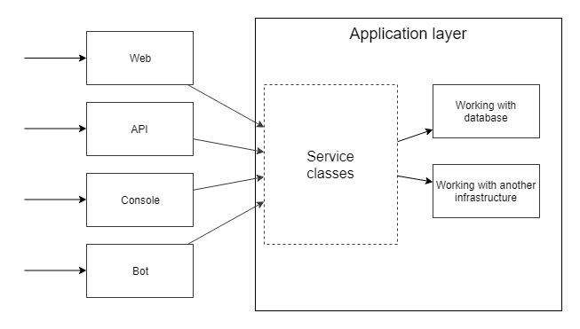
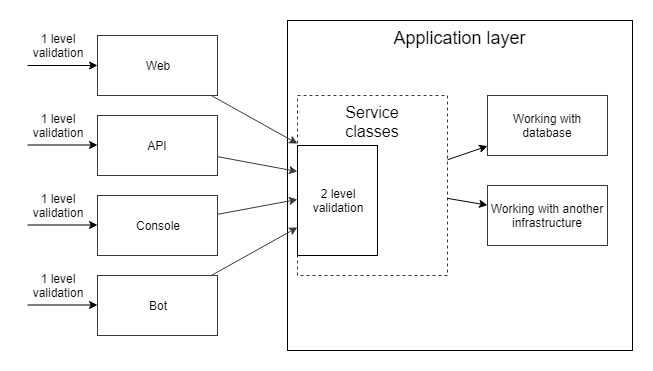

# Validation

A> "...But, now you come to me, and you say: "Don Corleone, give me justice." But you don't ask with respect. You don't offer friendship..."

## Database-related validation

As usual, let's start the chapter with a code example incorporating practices accumulated in previous chapters.
Creating an article:

```php
class PostController extends Controller
{
    public function create(Request $request, PostService $service)
    {
        $this->validate($request, [
            'category_id' => 'required|exists:categories',
            'title' => 'required',
            'body' => 'required',
        ]);
        
        $service->create(/* DTO */);
        
        //...
    }
}

class PostService
{
    public function create(CreatePostDto $dto)
    {
        $post = new Post();
        $post->category_id = $dto->categoryId;
        $post->title = $dto->title;
        $post->body = $dto->body;
        
        $post->saveOrFail();
    }
}
```

For the sake of brevity, I've reverted the validation back into the controller. One of the checks is the existence of the necessary category in the database. In the future, the **SoftDeletes** trait will be added to the **Category** model. This functionality will mark rows in the database as deleted instead of physically removing them, and it will also exclude rows marked as deleted from query results. The entire application will continue to work, not noticing this change, except for this validation. It will allow creating an article with a deleted category, thus violating data consistency. Let's fix it:

```php
$this->validate($request, [
    'category_id' => [
        'required|exists:categories,id,deleted_at,null',
    ],
    'title' => 'required',
    'body' => 'required',
]);
```
A check for the deletion mark was added. Many such corrections may be needed since articles are not only created. Any other change can again break our "smart" validation. For example, the "archived" mark for categories which will allow them to remain on the site but not allow adding new articles to them. We didn't make any changes to the article addition form and, in general, to the entire HTTP part of the application. Changes were related to business logic (archival categories) or data storage logic (soft delete). However, it is the HTTP request classes with their validation that need to be changed. This is another example of high coupling. Not long ago, we moved all database work to the Application Layer. However, out of old habits, we still go directly to the database from validation classes, ignoring all abstractions built using Eloquent or the Application Layer.





We need to separate the validation. In the HTTP layer validation, we simply need to ensure that the user has not made a mistake when entering data:

```php
$this->validate($request, [
    'category_id' => 'required',
    'title' => 'required',
    'body' => 'required',
]);

class PostService
{
    public function create(CreatePostDto $dto)
    {
        $category = Category::find($dto->categoryId);
        
        if($category === null) {
            // throw "Category not found" exception
        }
        
        if($category->archived) {
            // throw "Category archived" exception
        }
        
        $post = new Post();
        $post->category_id = $category->id;
        $post->title = $dto->title;
        $post->body = $dto->body;
        
        $post->saveOrFail();
    }
}
```
Validation that touches on business logic or the database should be conducted in more appropriate places. Now, the code works more stably: validation in controllers or **FormRequest** does not change due to random modifications in other layers. The **PostService::create** method does not trust such important checks to the calling code and validates everything itself. As a bonus, the application now has much clearer error messages.

## Two levels of validation





In the previous example, the validation was divided into two parts, and I mentioned that the **PostService::create** method does not trust complex validation to the calling code. However, it still trusts it in simple aspects:

```php
$post->title = $dto->title;
```
We assume the title will be non-empty, but there is no 100 percent certainty. Yes, it is currently checked by the 'required' rule during validation, but that is far away, somewhere in the controllers or even further. The **PostService::create** method could be called from another code, and this check might be forgotten there. Let's consider an example with user registration (it's more convenient):

```php
readonly final class RegisterUserDto
{
    public function __construct(
        public string $name,
        public string $email,
        public DateTime $birthDate,
    ) {}
}

class UserService
{
    public function register(RegisterUserDto $request)
    {
        $existingUser = User::whereEmail($request->email)
            ->first();
        
        if($existingUser !== null) {
            throw new UserWithThisEmailAlreadyExists(...);    
        }
        
        $user = new User();
        $user->name = $request->name;
        $user->email = $request->email;
        $user->birthDate = $request->birthDate;
        
        $user->saveOrFail();
    }
}
```
After using DTOs (Data Transfer Objects), we must forget the assumption that data in a web request was validated. Anyone can write code like this:

```php
$userService->register(new RegisterUserDto('', '', new DateTime()));
```
No one can guarantee that **name** will contain a non-empty string or that **email** will contain a string with a valid email address. What should we do? One solution is to duplicate the validation in the service class:

```php
class UserService
{
    public function register(RegisterUserDto $request)
    {
        if(empty($request->name)) {
            throw //
        }
        
        if(!filter_var($request->email, 
                        FILTER_VALIDATE_EMAIL)) {
            throw //
        }
        
        //...
    }
}
```
Or implement the same validation in the DTO class constructor. However, in the application, there will be numerous places where it's necessary to obtain an email, name, or similar data, leading to a lot of duplicated code. I can suggest two options.

## Validation with attributes

The **Symfony** project contains an excellent component for attribute-based validation - **symfony/validator**. Let's rewrite our **RegisterUserDto**:

```php
use Symfony\Component\Validator\Constraints as Assert;

readonly class RegisterUserDto
{
    public function __construct(
        #[Assert\NotBlank]
        private string $name;
        
        #[Assert\NotBlank]
        #[Assert\Email]
        private string $email;
        
        #[Assert\NotNull]
        private DateTime $birthDate;
    ) {}
}
```

**UserService** asks a validator and uses it to check a DTO object:

```php
class UserService
{
    public function __construct(
        private ValidatorInterface $validator
    ) {}
    
    public function register(RegisterUserDto $dto)
    {
        $violations = $this->validator->validate($dto);
                
        if (count($violations) > 0) {
            throw new ValidationException($violations);
        }
        
        $existingUser = User::whereEmail($dto->email)->first();
        
        if($existingUser !== null) {
            throw new UserWithThisEmailAlreadyExists(...);    
        }
        
        $user = new User();
        $user->name = $dto->name;
        $user->email = $dto->email;
        $user->birthDate = $dto->birthDate;
        
        $user->saveOrFail();
    }
}
```

Validation rules are described using annotations. The **ValidatorInterface::validate** method returns a list of validation rule violations. If it is empty, all is good. If not, a validation exception is thrown - **ValidationException**. A developer can be assured of data validity in the Application Layer using this explicit validation. Additionally, as a bonus, validation in the Web, API layers, etc., can be removed since all data have already been checked more thoroughly. This is a great idea, but there are some issues with it.

Firstly, the data in an HTTP request are not always the same as those passed to the Application Layer. When a user changes their password, the application requests the old password, the new password, and the new password to be repeated. The Web layer validation should check the new password fields for a match, while the Application Layer does not need this data; it only receives the values of the old and new passwords.

Another example: one of the values passed to the Application Layer is filled with the current user's email address. If this email turns out to be empty, the user might see a "The email format is incorrect" message, even though they did not enter any email! Therefore, validating user input in the Application Layer is not the best idea.

Imagine a DTO for creating a taxi order - **CreateTaxiOrderDto**. Let's say it's an air taxi, so orders can be from one country to another. There will be fields like **fromHouse**, **fromStreet**, **fromCity**, **fromState**, **fromCountry**, **toHouse**, **toStreet**, **toCity**,... A huge DTO with lots of fields, duplicating each other, depending on each other. A house number makes no sense without a street name. A street name is meaningless without a city and country. Validating such data would be complex and regularly duplicated in different DTO objects.

## Value Objects
The solution to this problem lies right in the **RegisterUserDto**. We do not store **$birthDay**, **$birthMonth**, and **$birthYear** separately. We do not validate them every time. We just store a **DateTime** object! It always contains the correct date and time. When comparing dates, we never compare their years, months, and days separately. There is a **diff()** method for date comparisons. This class contains all knowledge about dates, saving us from the need to duplicate logic working with them everywhere. It's worth trying to do something similar with other data:

```php
final class Email
{
    /** @var string */
    private $email;
    
    private function __construct(string $email)
    {
        if (!filter_var($email, FILTER_VALIDATE_EMAIL)) {
            throw new InvalidArgumentException(
                'Email ' . $email . ' is not valid');
        }
        
        $this->email = $email;
    }
    
    public static function createFromString(
        string $email)
    {
        return new static($email);
    }
    
    public function value(): string
    {
        return $this->email;
    }
}

final class UserName
{
    /** @var string */
    private $name;
    
    private function __construct(string $name)
    {
        if (/* Some validation of $name value*. 
            It depends on project requirements. */) {
            throw new InvalidArgumentException(
                'Invalid user name: ' . $name);
        }
        
        $this->name = $name;
    }
    
    public static function createFromString(
        string $name)
    {
        return new static($name);
    }
    
    public function value(): string
    {
        return $this->name;
    }
}

readonly final class RegisterUserDto
{
    public function __construct(
        public UserName $name,
        public Email $email,
        public DateTime $birthDate,
    ) {}
}
```
Yes, creating a class for every possible type of input data is not what every programmer dreams of. However, this is a natural way of decomposing an application. Instead of using strings and always doubting whether they contain the right value, these classes allow for always having correct values, as with DateTime. This pattern is called a **Value Object** (**VO**). The **email** field is no longer just a string. Now, this field is of type **Email**, which can be used without doubt wherever email addresses are needed. **UserService** can use these values without fear:

```php
final class UserService
{
    public function register(RegisterUserDto $dto)
    {
        //...
        $user = new User();
        $user->name = $dto->name;
        $user->email = $dto->email;
        $user->birthDate = $dto->bithDate;
        
        $user->saveOrFail();
    }
}
```
Value Objects (VOs) like **Email** can be used in Eloquent entities using the casting mechanism. This entails additional costs and necessitates reconsidering whether the project justifies such expenses. For many projects, the concerns described above are not so significant, and it is entirely possible to manage without such code complications. However, there are projects where the cost of an error would be too high, and efforts to protect data integrity would be justified.

## Value Object as a composition of values
The **Email** and **UserName** value objects are just wrappers for strings, but the **Value Object** pattern is a wider concept. A geographic coordinate can be described by two float values: longitude and latitude. Longitude is usually meaningless without knowing the latitude. By creating a **GeoPoint** object, developers can work with it throughout the application.

```php
readonly final class GeoPoint
{
    public function __construct(
        public float $latitude, 
        public float $longitude,
    ) {}
    
    public function isEqual(GeoPoint $other): bool
    {
        // just for example
        return $this->getDistance($other)->getMeters() < 10; 
    }

    public function getDistance(GeoPoint $other): Distance
    {
        // distance calculation logic
    }
}

final class City
{
    //...
    private GeoPoint $centerPoint;

    public function getDistance(City $other): Distance
    {
        return $this->centerPoint
                    ->getDistance($other->centerPoint);
    }
}
```
An example of how knowledge about coordinates is encapsulated in the **GeoPoint** class is the **getDistance** method of the **City** class. It doesn't work with latitude and longitude. It knows nothing about geo coordinates. It delegates the distance calculation logic to the object that knows more about it — **GeoPoint**.

Other examples of value objects:

- **Money** (int **amount**, Currency **currency**)
- **Address** (string **street**, string **city**, string **state**, string **country**, string **zipcode**)

Have you noticed that in the previous example, I tried not to use primitive types, such as strings and numbers? The **getDistance()** method returns a **Distance** object, not an int or float. The **Distance** class could have methods like **getMeters()**: float or **getMiles()**: float, as well as **Distance::isEqual**(**Distance** **$other**) for comparing two distances. It is also a value object! For many projects, such detail is excessive, and a **GeoPoint::getDistance()** method that returns the floating-point number of the distance in meters is more than sufficient. I just wanted to show an example of what I call "object thinking".

## Value Objects and validation

```php
final class UserController extends Controller
{
    public function register(
        Request $request, UserService $service)
    {
        $this->validate($request, [
            'name' => 'required',
            'email' => 'required|email',
            'birth_date' => 'required|date',
        ]);
        
        $service->register(new RegisterUserDto(
            UserName::create($request['name']),
            Email::create($request['email']),
            DateTime::createFromFormat('some format', $request)
        ));
        
        //return ok response
    }
}
```

It's easy to find a code duplication here. Email value is validated by Laravel validation, and then in the **Email** class constructor:

```php
final class Email
{
    private function __construct(string $email)
    {
        if (!filter_var($email, FILTER_VALIDATE_EMAIL)) {
            throw new InvalidArgumentException(
                'Email ' . $email . ' is not valid');
        }
        
        $this->email = $email;
    }
    
    //...
}
```

The idea of removing the Laravel validation code seems intriguing. We can eliminate the **$this->validate()** call and simply catch the **InvalidArgumentException** in a global error handler. However, as mentioned, HTTP request data are not always equivalent to the data passed to the Application Layer. Furthermore, an **InvalidArgumentException** could be thrown in many other situations, potentially leading to situations where users see errors related to data they did not input.

If you recall, PhpStorm defaults to three classes of unchecked exceptions: **Error**, **RuntimeException**, and **LogicException**:

- **Error** indicates a PHP language error, such as **TypeError**, **ParseError**, etc.
- **RuntimeException** indicates a runtime error independent of our code, such as issues with database connections.
- **InvalidArgumentException** inherits from **LogicException**. The PHP documentation describes **LogicException** as "Exception that represents error in the program logic. This kind of exception should lead directly to a fix in your code." Therefore, if the code is correctly written, it should never throw a **LogicException**.

This means that checks in the constructors of value objects are only meant to ensure that the data has been previously validated by Laravel validation or something else. They should not be used as a validation of user-entered data. This is a validation of our application's code.

## A few words at the end of the chapter

Moving logic to the Application Layer leads to some data validation problems. We cannot directly use **FormRequest** objects and must use  Data Transfer Objects (DTOs), even if they are just simple arrays. If the Application Layer always receives exactly the data entered by the user, then all validation could be moved there, using a solution like the **symfony/validator** package or another. However, this can be risky and inconvenient when dealing with complex data structures, such as addresses or geographic points.

Validation could be left in the Web, API, and other parts of the code, while the Application Layer trusts the data passed to it. From my experience, this only works in small projects. Large projects (with many developers) will constantly face issues with invalid data, leading to incorrect values in the database or throwing incorrect exceptions.

The value object pattern requires some additional coding and "thinking in objects" from developers, but it is the safest and most natural way to represent data that carries some additional meaning, i.e., "not just a string, but an email." As always, it's a choice between short-term and long-term efficiency.