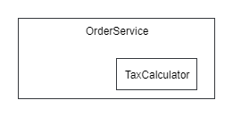
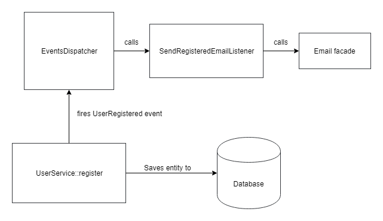
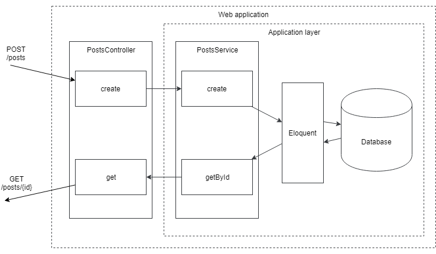
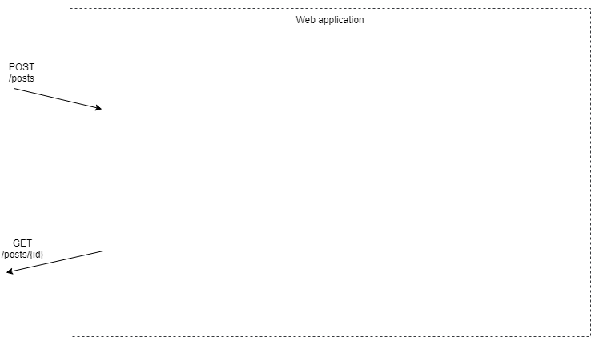

# Unit testing

## First steps

You've likely heard about unit testing. It's pretty popular nowadays. I often talk to developers who claim they don't start writing code until they've written a test for it. TDD enthusiasts! Starting with unit testing can be challenging, especially with frameworks like Laravel. Unit tests are among the best indicators of code quality in a project. Frameworks aim to make adding new features as quick as possible, allowing for shortcuts in some areas, but highly coupled code is a common price to pay. Entities tightly bound to the database and classes with many dependencies that can be hard to identify (Laravel facades). In this chapter, I'll try to test Laravel application code and show the main difficulties, but let's start from the very beginning.

A **pure function** is a function whose result depends **only** on its input data. It doesn't change any external values and simply computes a result. Examples:

```php
function strpos(string $needle, string $haystack)
function array_chunk(array $input, $size, $preserve_keys = null)
```

Pure functions are very simple and predictable. Writing unit tests for them is easy. Let's try writing a simple function (it could also be a class method) using the TDD method:

```php
function cutString(string $source, int $limit): string
{
    return ''; // just to start
}

class CutStringTest extends \PHPUnit\Framework\TestCase
{
    public function testEmpty()
    {
        $this->assertEquals('', cutString('', 20));
    }

    public function testShortString()
    {
        $this->assertEquals('short', cutString('short', 20));
    }

    public function testCut()
    {
        $this->assertEquals('long string shoul...', 
            cutString('long string should be cut', 20));
    }
}
```

I am using PHPUnit here for writing tests.
The function name is inaccurate, but one can understand what it does just by looking at the tests.
The tests verify the result using assertEquals.
Unit tests can serve as documentation for the code if they are as simple and easy to read.

If I run these tests, I will get the following output:

```
Failed asserting that two strings are equal.
Expected :'short'
Actual   :''

Failed asserting that two strings are equal.
Expected :'long string shoul...'
Actual   :''
```

Obviously, since our function is not written yet. It's time to do it:

```php
function cutString(string $source, int $limit): string
{
    $len = strlen($source);

    if($len < $limit) {
        return $source;
    }

    return substr($source, 0, $limit-3) . '...';
}
```

PHPUnit output after these changes:

```
OK (3 tests, 3 assertions)
```
The unit test class contains a list of requirements for the function:

* For an empty string, the result should also be empty.
* The same string should be returned without changes for strings that are shorter than the limit.
* For strings longer than the limit, the result should be the string shortened to this limit with three dots at the end.

Successful tests indicate that the code meets the requirements.
But it's not true!
The code has an error, and the function does not work as intended if the string length matches the limit.
A good habit: if a bug is found, you should write a test that reproduces it and fails.
In any case, we will need to check if this bug has been fixed, and a unit test is the most suitable place for it.
New test methods:

```php
class CutStringTest extends \PHPUnit\Framework\TestCase
{
    // old tests
    
    public function testLimit()
    {
        $this->assertEquals('limit', cutString('limit', 5));
    }

    public function testBeyondTheLimit()
    {
        $this->assertEquals('beyondl...', 
                            cutString('beyondlimit', 10));
    }
}
```

**testBeyondTheLimit** is successful, but **testLimit** fails:

```
Failed asserting that two strings are equal.
Expected :'limit'
Actual   :'li...'
```

The fix is trivial: change **<** to **<=**

```php
function cutString(string $source, int $limit): string
{
    $len = strlen($source);

    if($len <= $limit) {
        return $source;
    }

    return substr($source, 0, $limit-3) . '...';
}
```

Immediately run tests:

```
OK (5 tests, 5 assertions)
```

Boundary value checks (0, length **$limit**, length **$limit**+1, etc.) are an essential part of testing.
Many errors are located there.

When I was writing the **cutString** function, I thought that I would need the length of the original string later on, so I saved it in a variable. But it turned out that we only need the **$limit** variable.
Now, I can remove this variable.

```php
function cutString(string $source, int $limit): string
{
    if(strlen($source) <= $limit) {
        return $source;
    }

    return substr($source, 0, $limit-3) . '...';
}
```

And again, run the tests!
I changed the code and could break something in the process.
It's better to detect and fix this as soon as possible.
This habit significantly increases overall productivity.
With well-written tests, almost any error will be caught immediately, and the developer can fix it while the code they changed is still fresh in their mind.

I focused all my attention on the main functionality and forgot the preconditions.
Of course, the **$limit** parameter in a real project will never be too small, but good function design implies checking this value as well:

```php
class CutStringTest extends \PHPUnit\Framework\TestCase
{
    //...
    
    public function testLimitCondition()
    {
        $this->expectException(InvalidArgumentException::class);
        
        cutString('limit', 4);
    }
}

function cutString(string $source, int $limit): string
{
    if($limit < 5) {
        throw new InvalidArgumentException(
            'The limit is too low');
    }
        
    if(strlen($source) <= $limit) {
        return $source;
    }

    return substr($source, 0, $limit-3) . '...';
}
```

**expectException** call checks that an exception will be thrown. If it does not, the test is considered failed.

## Testing stateful classes

Pure functions are great, but there are too many things in the real world that cannot be described exclusively by them.
Objects can have **state**.
Unit testing stateful classes is more complicated.
For such tests, there is a recommendation to divide the test code into three parts:
1. **initialization** of the object in the required state
2. **execution** of the action being tested
3. **verification** of the result

I> There's also the AAA pattern: Arrange, Act, Assert, which describes the same three steps.

Let's start with a simple example of testing an imaginary entity **Article**, which is not an Eloquent model.
It can only be created with a non-empty title, while the text can be empty.
However, this article can only be published if its text is not empty.

```php
class Post
{
    public string $title; 
    public string $body;
    public bool $published = false;

    public function __construct(
        $title, $body
    ) {
        if (empty($title)) {
            throw new InvalidArgumentException(
                'Title should not be empty');
        }

        $this->title = $title;
        $this->body = $body;
    }

    public function publish()
    {        
        if (empty($this->body)) {
            throw new CantPublishException(
                'Cant publish post with empty body');
        }

        $this->published = true;
    }
}
```

**Post** class constructor is a pure function, so tests for it look like previous ones:

```php
class CreatePostTest extends \PHPUnit\Framework\TestCase
{
    public function testSuccessfulCreate()
    {
        // initialization and execution
        $post = new Post('title', '');

        // verification
        $this->assertEquals('title', $post->title);
    }

    public function testEmptyTitle()
    {
        // verification
        $this->expectException(InvalidArgumentException::class);

        // initialization and execution
        new Post('', '');
    }
}
```

However, the **publish** method depends on the current state of the object, making test steps more significant:

```php
class PublishPostTest extends \PHPUnit\Framework\TestCase
{
    public function testSuccessfulPublish()
    {
        // initialization
        $post = new Post('title', 'body');

        // execution
        $post->publish();

        // verification
        $this->assertTrue($post->published);
    }

    public function testPublishEmptyBody()
    {
        // initialization
        $post = new Post('title', '');

        // verification
        $this->expectException(CantPublishException::class);

        // execution
        $post->publish();
    }
}
```

When testing exceptions, the **verification** step, which usually comes last, happens before the **execution**. Testing stateful classes is more complex than testing pure functions because the developer needs to keep in mind the state of the object and check all possible state-change pairs.

## Testing classes with dependencies

One of the critical features of unit testing is testing in isolation. A unit (whether a class, function, or other module) should be isolated from the rest of the world. This guarantees that the test only tests that module. A test can only fail for two reasons: either the test or the code of the module under test is wrong. Neither a misconfigured database nor a bug in one of the used libraries can cause unit tests to fail. Testing in isolation offers this simplicity and speed. True unit tests run very fast, as they don't perform heavy operations like database queries, file readings, or API calls. When a class requires DI (Dependency Injection) dependencies, the test should provide them.

### Dependencies on actual classes

In the chapter on dependency injection, I wrote about two types of possible interfaces:

1. There is an interface with several possible implementations.
2. There is an interface with one implementation.

I suggested not creating an interface for the second case, but now I want to analyze this. What kind of dependency can only be implemented in one possible way? All I/O operations, such as API calls, file operations, or database queries, can always have other possible implementations with a different driver, decorator, etc. Sometimes, a class contains large computations, and the developer extracts this logic into a separate class. This new class becomes a new dependency. In this case, it's hard to imagine another possible implementation of this dependency, and this is a perfect moment to talk about encapsulation and why unit testing is called unit testing, not class testing or function testing.

This is an example of the described case. The **TaxCalculator** class was extracted from the **OrderService** class.

```php
class OrderService
{
    public function __construct(
        private TaxCalculator $taxCalculator
    ) {}
    
    public function create(OrderCreateDto $orderCreateDto)
    {
        $order = new Order();
        //...
        $order->sum = ...;
        $order->taxSum = $this->taxCalculator
                            ->calculateTax($order);
        //...
    }
}
```

But if we look at the **OrderService** class, we'll see that **TaxCalculator** doesn't appear to be its dependency. It doesn't seem like something external that **OrderService** needs; it looks like a part of the **OrderService** class.





**OrderService** here is a module that contains not only the **OrderService** class but also the **TaxCalculator** class. The **TaxCalculator** class should be an internal dependency, not an external one.

```php
class OrderService
{
    private TaxCalculator $taxCalculator = new TaxCalculator();
    //...
}
```

The rest of the code doesn't necessarily need to know about **TaxCalculator**. Unit tests can test the **OrderService** class without worrying about providing a **TaxCalculator** object. If conditions change and **TaxCalculator** becomes an external dependency (different tax calculation algorithms), it will be easy to make it public by putting it as a parameter in the constructor and changing the test code.

A module is a wide concept. At the beginning of this article, a module was a small function, but sometimes a module can contain several classes. Software objects within a module should be focused on a single responsibility; in other words, they should have strong cohesion. When a class's methods are completely independent, the class is not a module. Each method of the class is a module, in this case. Perhaps it's worth extracting these methods into separate classes so that developers don't have to go through a bunch of unnecessary code every time.

### Stubs and fakes

Typically, a dependency is an interface that has multiple implementations. Using actual implementations of this interface during unit testing is a bad idea because they might perform heavy I/O operations that slow down testing and prevent the module from being tested in isolation. The execution of unit tests should be lightning-fast since they will be run frequently, and the developer mustn't lose focus on the code upon running them. Write code - run tests, write more code - run tests again. Fast-running tests allow them to remain more productive without getting distracted. The straightforward solution to the problem of isolating a class from its dependencies is to create a separate implementation of this interface intended just for testing. Let's go back to the previous example and imagine that **TaxCalculator** has become a dependency and is now an interface with some implementation.

```php
interface TaxCalculator
{
    public function calculateTax(Order $order): float;
}

class OrderService
{
    public function __construct(
        private TaxCalculator $taxCalculator
    ) {}
    
    public function create(OrderCreateDto $orderCreateDto)
    {
        $order = new Order();
        //...
        $order->sum = ...;
        $order->taxSum = $this->taxCalculator
                            ->calculateTax($order);
        //...
    }
}

class FakeTaxCalculator implements TaxCalculator
{
    public function calculateTax(Order $order): float
    {
        return 0;
    }
}

class OrderServiceTest extends \PHPUnit\Framework\TestCase
{
    public function testCreate()
    {
        $orderService = new OrderService(new FakeTaxCalculator());

        $orderService->create(new OrderCreateDto(...));

        // some assertions
    }
}
```

It works! Such classes are called fakes. Unit testing libraries can create these classes on the fly. The same test, but using the **createMock** method of the PHPUnit library:

```php
class OrderServiceTest extends \PHPUnit\Framework\TestCase
{
    public function testCreate()
    {
        $stub = $this->createMock(TaxCalculator::class);

        $stub->method('calculateTax')
            ->willReturn(0);

        $orderService = new OrderService($stub);

        $orderService->create(new OrderCreateDto(...));

        // some assertions
    }
}
```

Stubs are convenient when you need to set up a simple implementation quickly, but when there are many tests with this dependency, using a fake class appears more optimal. Testing libraries can create stubs not only for interfaces but also for actual classes, which can be very handy when working with legacy projects.

### Mocks

Sometimes, a developer wants to test whether a stub's methods were called, how many times, and with what parameters.

> Generally, I don't consider the idea of testing the method calls of dependencies a good one.
> In this case, the unit test starts to know too much about how the class works.
> As a result, such tests break very easily.
> A minor refactoring, and the tests fail.
> If this happens too often, a team might just give up on unit testing.
> This is called "white-box testing".
> "Black-box testing" tests only the input and output data without digging inside.
> Of course, black-box testing is much more stable.

These checks can be implemented in a fake class, but this would be pretty difficult, and few would want to do this for every possible dependency. Testing libraries can create special mock classes that make verifying the calls to their methods easy.

```php
class OrderServiceTest extends \PHPUnit\Framework\TestCase
{
    public function testCreate()
    {
        $stub = $this->createMock(TaxCalculator::class);

        // Mock class configuration
        $stub->expects($this->once())
            ->method('calculateTax')
            ->willReturn(0);

        $orderService = new OrderService($stub);

        $orderService->create(new OrderCreateDto(...));

        // some checks
    }
}
```

Now, the test verifies that during the execution of the method **OrderService::create** with the given parameters, **TaxCalculator::calculateTax** was called exactly once. With mock classes, you can perform various checks on parameter values and the number of calls, set return values, throw exceptions, etc. I don't want to focus on this in this book. Fakes, stubs, and mocks are collectively known as test doubles, a term for objects that substitute real ones during testing. They can be used not only in unit tests but also in integration tests.

## Types of software testing

People have invented many ways to test applications. Security testing checks applications for various vulnerabilities. Performance testing checks how well the application behaves under load. In this chapter, we will focus on verifying the correctness of application operations. Unit testing has already been covered. **Integration testing** checks the joint operation of several modules. Example: ask **UserService** to register a new user; check that a new row has been created in the database, the necessary event (**UserRegistered**) was generated, and the corresponding email was sent (or at least the framework received a command to do this).





**Functional testing** (also known as acceptance or E2E — end-to-end) tests the application for compliance with functional requirements.
Example: The requirement to create some entity.
The test opens a browser, goes to a specific page, fills in fields with values, "clicks" the create button, and checks that the required entity was created by searching for it on a certain page.

## Testing in Laravel

Laravel provides many tools for various types of testing.

### Laravel tools for functional testing

Tools for testing HTTP requests, browser interactions, and console commands make functional testing in Laravel quite convenient, but I don't like the examples from the documentation.
One of them, slightly modified:

```php
class ExampleTest extends TestCase
{
    public function testBasicExample()
    {
        $response = $this->postJson('/users', [
            'name' => 'Sally',
            'email' => 'sally@example.com'
        ]);

        $response
            ->assertOk()
            ->assertJson([
                'created' => true,
            ]);
    }
}
```

This test just verifies that the **POST /user** request returned a successful result. It doesn't look like a complete test. The test should verify that the user was actually created. But how? The first answer that comes to mind is to simply make a query to the database and check. Here's another example from the documentation:

```php
class ExampleTest extends TestCase
{
    public function testDatabase()
    {
        // user creation request
    
        $this->assertDatabaseHas('users', [
            'email' => 'sally@example.com'
        ]);
    }
}
```

Ok. Let's write another test the same way:

```php
class PostsTest extends TestCase
{
    public function testDelete()
    {
        $response = $this->deleteJson('/posts/1');

        $response->assertOk();
        
        $this->assertDatabaseMissing('posts', [
            'id' => 1
        ]);
    }
}
```

There's a trap here, much like the one in the chapter about validation. Adding the **SoftDeletes** trait to the **Post** class will break this test. However, the application works and fulfills the same requirements, and users won't notice this difference. Functional tests should not fail under such conditions. A test that makes a request to the application and then digs into the database to check the result is not a true functional test. It knows too much about how the application works, how it stores data, and which tables it uses. This is another example of white-box testing.

As mentioned, functional testing checks whether the application meets the functional requirements. Functional testing is not about the database but the application as a whole. Therefore, proper functional tests do not check anything inside the application; they operate from the outside.

```php
class PostsTest extends TestCase
{
    public function testCreate()
    {
        $response = $this->postJson('/api/posts', [
            'title' => 'Post test title'
        ]);

        $response
            ->assertOk()
            ->assertJsonStructure([
                'id',
            ]);

        $checkResponse = $this->getJson(
            '/api/posts/' . $response->getData()->id);

        $checkResponse
            ->assertOk()
            ->assertJson([
                'title' => 'Post test title',
            ]);
    }
    
    public function testDelete()
    {
        // Some initialization here to create
        // a Post object with id = $postId

        // Check that this post exists 
        $this->getJson('/api/posts/' . $postId)
            ->assertOk();
        
        // Delete it
        $this->jsonDelete('/posts/' . $postId)
            ->assertOk();
        
        // Check that it doesn't exist anymore
        $this->getJson('/api/posts/' . $postId)
            ->assertStatus(404);
    }
}
```

This test doesn't care how an object is deleted, whether through a 'delete' SQL query or using the Soft Delete pattern. A functional test checks the overall behavior of the application. If an object is deleted, the expected behavior is that it cannot be retrieved by its ID, and the test checks exactly this.

The schema for processing "POST /posts/" and "GET /post/{id}" requests:





What a functional test should see: 





### Laravel facades mocks

Laravel offers a convenient implementation of the **Service Locator** pattern - Laravel facades. Laravel provides tools for testing code that utilizes facades. Let's rewrite one of the previous examples using Laravel facades and test this code:

```php
final class Survey extends Model
{
    public function options()
    {
        return $this->hasMany(SurveyOption::class);
    }
}

final class SurveyOption extends Model
{
}

final class SurveyCreated
{
    public function __construct(
        public readonly int $surveyId
    ) {}
}

final class SurveyCreateDto
{
    public function __construct(
        public readonly string $title,
        /** @var string[] */ 
        public readonly array $options,
    ) {}
}

final class SurveyService
{
    public function create(SurveyCreateDto $dto)
    {
        if(count($dto->options) < 2) {
            throw new BusinessException(
                "Please provide at least 2 options");
        }

        $survey = new Survey();

        \DB::transaction(function() use ($dto, $survey) {
            $survey->title = $dto->title;
            $survey->save();

            foreach ($dto->options as $option) {
                $survey->options()->create([
                    'text' => $option,
                ]);
            }
        });

        \Event::dispatch(new SurveyCreated($survey->id));
    }
}

class SurveyServiceTest extends TestCase
{
    public function testCreate()
    {
        \Event::fake();

        $postService = new SurveyService();
        $postService->create(new SurveyCreateDto(
            'test title', 
            ['option1', 'option2']));

        \Event::assertDispatched(SurveyCreated::class);
    }
}
```

* Calling **\Event::fake()** transforms the Laravel facade **Event** into a mock object.
* The method **SurveyService::create** creates a survey with answer options, saves it in the database, and generates the **SurveyCreated** event.
* Calling **\Event::assertDispatched** checks that this event was triggered.

I see several drawbacks:

* This is not a unit test. The **\Event** facade was replaced with a mock, but not the database. Actual rows will be added to the database. The **RefreshDatabase** trait, which recreates the database from scratch each time, is usually added to the test class to make this test cleaner. This is very slow. One such test can be executed in a reasonable time, but hundreds of them will take several minutes, and no one will perform them after every minor edit.
* The tests only check event generation. The **assertDatabaseHas** or **SurveyService::getById** calls are needed to verify the creation of records in the database.
* The dependencies of the **SurveyService** class are not explicitly described. The **Event** facade is called somewhere inside. You need to review its entire code to understand what exactly it requires for its work. This makes writing tests for it quite inconvenient. Worse, if a new dependency is added to the class using a Laravel facade, the tests will continue to work as if nothing happened, but with the actual implementation of this facade: real API calls, etc. I've heard several stories when developers ran tests, and it led to thousands of actual money transfers! Such issues arise precisely from cases when an actual implementation is unexpectedly used in the tests.

I call this "forced integration testing." The developer wants to write a unit test, but the code is so highly coupled, so tightly integrated with the framework, that it just doesn't work out. Let's try to do this! 

## Application layer unit testing

### Dealing with Laravel facades

It's necessary to remove the use of Laravel facades and the database to test the **SurveyService::create** method in isolation. The first part isn't difficult, thanks to Dependency Injection.

* The **\Event** facade represents the **Illuminate\Contracts\Events\Dispatcher** interface.
* The **\DB** facade represents the **Illuminate\Database\ConnectionInterface**.

Actually, the last point isn't entirely true. The **\DB** facade represents the **\Illuminate\Database\DatabaseManager**, which involves some magic like this:

```php
class DatabaseManager
{
    /**
     * Dynamically pass methods to the default connection.
     *
     * @param  string  $method
     * @param  array   $parameters
     * @return mixed
     */
    public function __call($method, $parameters)
    {
        return $this->connection()->$method(...$parameters);
    }
}    
```

But directly using the **ConnectionInterface** will be enough.

```php
class SurveyService
{
    public function __construct(
        private ConnectionInterface $connection, 
        private Dispatcher $dispatcher
    ) {}

    public function create(SurveyCreateDto $dto)
    {
        if(count($dto->options) < 2) {
            throw new BusinessException(
                "Please provide at least 2 options");
        }

        $survey = new Survey();

        $this->connection->transaction(function() use ($dto, $survey) {
            $survey->title = $dto->title;
            $survey->save();

            foreach ($dto->options as $option) {
                $survey->options()->create([
                    'text' => $option,
                ]);
            }
        });

        $this->dispatcher->dispatch(new SurveyCreated($survey->id));
    }
}
```

For the **ConnectionInterface**, you can create a fake class **FakeConnection** (its implementation would be pretty simple). The **EventFake** class, which is used when **\Event::fake()** is called, can be used directly.

```php
use Illuminate\Support\Testing\Fakes\EventFake;
//...

class SurveyServiceTest extends TestCase
{
    public function testCreateSurvey()
    {
        $eventFake = new EventFake(
            $this->createMock(Dispatcher::class));

        $postService = new SurveyService(
            new FakeConnection(), $eventFake);
        
        $postService->create(new SurveyCreateDto(
            'test title',
            ['option1', 'option2']));

        $eventFake->assertDispatched(SurveyCreated::class);
    }
}
```

This test may look very similar to the previous one with facades, but now it's much stricter regarding the dependencies of the **SurveyService** class. However, any developer can still use any facade within the **SurveyService** class, and the test will continue to work. This happens because a special base test class provided by Laravel is used, which fully configures the working environment.

```php
use Illuminate\Foundation\Testing\TestCase as BaseTestCase;

abstract class TestCase extends BaseTestCase
{
    use CreatesApplication;
}
```

For unit tests, using the standard PHPUnit base class is essential:

```php

abstract class TestCase extends \PHPUnit\Framework\TestCase
{    
}
```

Now, if someone adds a facade call, the test will fail with an error:

```
Error : Class 'SomeFacade' not found
```

Great! We have entirely removed Laravel facades from our code.

### Dealing with database

Detaching from the database is indeed more challenging. Let's create a repository class (using the **Repository** pattern) to encapsulate all database interactions. This simplifies testing by allowing you to mock the repository in your unit tests instead of hitting the actual database.

```php
interface SurveyRepository
{
    //... other methods

    public function save(Survey $survey);

    public function saveOption(SurveyOption $option);
}

class EloquentSurveyRepository implements SurveyRepository
{
    //... other methods

    public function save(Survey $survey)
    {
        $survey->save();
    }

    public function saveOption(SurveyOption $option)
    {
        $option->save();
    }
}

class SurveyService
{
    public function __construct(
        private ConnectionInterface $connection, 
        private SurveyRepository $repository, 
        private Dispatcher $dispatcher
    ) {}

    public function create(SurveyCreateDto $dto)
    {
        if(count($dto->options) < 2) {
            throw new BusinessException(
                "Please provide at least 2 options");
        }

        $survey = new Survey();

        $this->connection->transaction(function() use ($dto, $survey) {
            $survey->title = $dto->title;
            $this->repository->save($survey);

            foreach ($dto->options as $optionText) {
                $option = new SurveyOption();
                $option->survey_id = $survey->id;
                $option->text = $optionText;

                $this->repository->saveOption($option);
            }
        });

        $this->dispatcher->dispatch(new SurveyCreated($survey->id));
    }
}

class SurveyServiceTest extends \PHPUnit\Framework\TestCase
{
    public function testCreateSurvey()
    {
        $eventFake = new EventFake(
            $this->createMock(Dispatcher::class));

        $repositoryMock = $this->createMock(SurveyRepository::class);

        $repositoryMock->method('save')
            ->with($this->callback(function(Survey $survey) {
                return $survey->title == 'test title';
            }));

        $repositoryMock->expects($this->at(2))
            ->method('saveOption');

        $postService = new SurveyService(
            new FakeConnection(), $repositoryMock, $eventFake);
        
        $postService->create(new SurveyCreateDto(
            'test title',
            ['option1', 'option2']));

        $eventFake->assertDispatched(SurveyCreated::class);
    }
}
```

This is a correct unit test. The **SurveyService** class was tested in complete isolation without touching the Laravel environment or the database. However, I'm not entirely satisfied for the following reasons:

* I was forced to create an abstraction with a repository solely to write unit tests. The **SurveyService** class code without it looks much more readable, which is very important. It resembles the **Repository** pattern but isn't quite it. It simply attempts to replace Eloquent operations with the database. If the survey object has more relationships, I would need to implement **save%RelationshipName%** methods for each of them.
* Almost all Eloquent operations are prohibited. They will work correctly in the real application but not in unit tests. Developers will repeatedly ask themselves, "What are these unit tests for?"
* On the other hand, such unit tests are very complex: challenging to write and read. And it's an example of one of the most straightforward cases — just creating a single entity with relationships.
* Every added dependency will require rewriting all unit tests, making maintaining such tests quite labor-intensive.

It's hard to measure, but it seems to me that the benefits of such tests are much less than the effort spent on them and the damage to code readability. At the beginning of this chapter, I said that unit tests are one of a project's best code quality indicators. If the code is difficult to test, it likely has high coupling. The **SurveyService** class certainly does. It contains the core logic (checking the number of answer options and creating an entity) as well as application logic (database transactions, event generation, API requests, etc.). It can be fixed by extracting this core logic from the class. We will talk about this in the next chapter.

## Application testing strategy

In this section, I don't want to talk about large companies that create or already have testing strategies before the project starts. The discussion is about small projects that begin to grow. In the beginning, the project is tested by team members simply by using the application. Occasionally, the manager or developers open the application and perform some actions, checking its correctness and how beautiful its interface is. This is manual testing without any strategy.

Later (usually after some painful bugs in production), the team decides to change something.

The first obvious solution is to hire a manual QA. They test new functionality and can describe the main scenarios of working with the application. After each update, they repeat these scenarios, checking that the application works as required. Key terms here are smoke tests and regression testing.

If the application continues to grow, the number of scenarios will also increase. At the same time, the team will likely start to release updates more frequently, and manually checking each scenario with each update will become impossible. The solution is to write automated tests. Scenarios written by the manual tester can be converted into automated tests for Selenium or other functional testing tools.

From the perspective of your application's user, functional testing is the most important, and it is highly desirable to pay sufficient attention to it. Especially if your application is an API, writing functional tests for it is a pleasure.

What about unit tests? Yes, they can help us check many specific cases difficult to cover with functional tests, but their main task is to help us write code. Remember the **cutString** example at the beginning of the chapter? Contrary to popular belief, writing such code with tests is often faster than without them. Tests immediately check the code for correctness, verify the behavior of the code in edge cases, and later prevent changes in the code from violating the requirements for this code. Writing unit tests should be simple. They should not be a heavy burden on the project's neck, constantly wanting to be thrown away. There are surely many pure functions in any application code, and writing them with tests is an excellent practice.

However, as we've already seen, writing unit tests for controllers or the Application Layer is quite unpleasant, and maintaining them even more so. "Forced integration" tests are more straightforward, but they can be unstable. If your project has core logic that you really want to cover with unit tests, for example, to check behavior in edge cases, this is a strong hint that the project's core logic has grown so much that it needs to be separated from the Application Layer into its own layer.