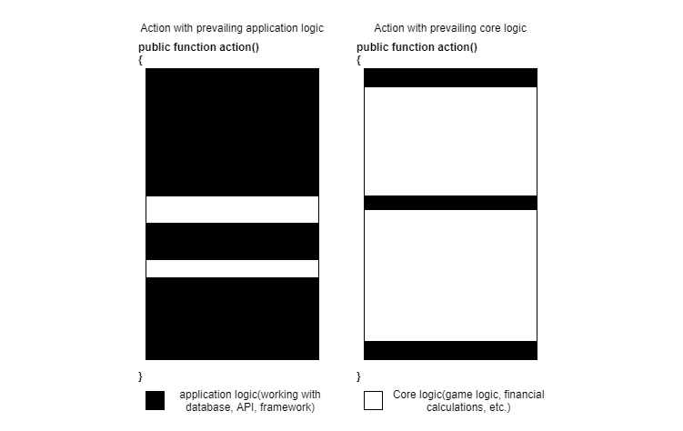

# Domain Layer

## When and Why?

Business logic, or Domain logic, represents the logic that application users keep in mind without UI, database, etc. For example, in the case of a game, it would include the complete set of its rules, while for a financial application, it would encompass all entities present and all the rules for calculations. For a blog, the business logic can roughly be described as follows:
* There are articles, each with a title and text.
* An administrator can create and publish them.
* Other users can see all published articles.

Complex applications can be divided into two classes:

* Complex application logic but average or even simple business logic. Example: high-traffic social networks or other content projects. The application logic there is massive: SEO, API integrations, authorizations, content search, etc. However, compared to this, the business logic is quite simple: posts and comments.
* Truly complex business logic and complex or not-so-complex application logic. Examples include games or enterprise applications.





The application logic is marked in black here, while the business logic is white. Obviously, extracting business logic into a separate layer is almost mandatory for the second type of application. It can also be beneficial for the first type, but proving this might not be as straightforward.

Extracting business logic into a separate layer is a serious task, especially for an already implemented application that uses Eloquent or other Active Record pattern implementations for database interaction. The connection between objects and the database in these implementations is tight and inseparable. They must be completely detached from the database and implemented as independent entities containing the domain logic. This task can require colossal effort and time, so the decision to create a Domain Layer must be based on serious reasons. I will list some of these reasons, and they should be considered carefully by the project's architect. On the other side of the scale, there should be a heavy weight representing the time, sweat, and blood of developers who will have to rethink much if all the business logic was previously implemented by objects representing database table rows.

### Unit Testing

In the previous chapter, we found out that writing unit tests for the application layer is very difficult and not particularly useful. Therefore, for applications with not very complex business logic, such tests are almost never written. Functional tests for these applications are much more important.

On the other hand, covering complex logic with functional tests is very costly in terms of developer time and, consequently, money. Time is spent both on writing such tests and on executing them. For large applications, the entire set of functional tests can take hours to run. Writing complex logic with unit tests is much more efficient and productive, and they run in milliseconds. But the tests themselves must be very simple. Let's compare a unit test for a class that describes an entity, not a row in the database, with unit tests for the application layer. I won't copy the monstrous tests from the previous chapter, but tests for an entity like Post - easily:

```php
class CreatePostTest extends \PHPUnit\Framework\TestCase
{
    public function testSuccessfulCreate()
    {
        $post = new Post('title', '');

        $this->assertEquals('title', $post->title);
    }

    public function testEmptyTitle()
    {
        $this->expectException(InvalidArgumentException::class);

        new Post('', '');
    }
}

class PublishPostTest extends \PHPUnit\Framework\TestCase
{
    public function testSuccessfulPublish()
    {
        $post = new Post('title', 'body');

        $post->publish();

        $this->assertTrue($post->published);
    }

    public function testPublishEmptyBody()
    {
        $post = new Post('title', '');

        $this->expectException(CantPublishException::class);

        $post->publish();
    }
}
```

These tests require minimal effort. They are easy to write and maintain. Implementing complex entity logic with well-written tests becomes much simpler. The simplicity and ease of such tests result from the **Post** class implementing a single responsibility - the logic of the Post entity. It is not distracted by things like database interaction. The Domain Layer is built from such classes.

### Ease of Code Maintenance

Implementing both business and application logic in one place violates the Single Responsibility Principle. The punishment for this will follow quite swiftly. And, of course, it won't be a single guillotine strike. This skilled executioner will torture slowly. Every movement will cause pain. The amount of duplicated code will grow. Any attempt to extract logic into a method or class will encounter significant resistance. Two logics intertwined into one will always need to be separated from each other before refactoring.

Extracting domain logic into a separate layer allows developers to always focus on one logic, simplifying the refactoring process and allowing the application to stay in shape without spending a lot of time.

### Active Record and Data Mapper

Eloquent is an implementation of the Active Record pattern. Eloquent model classes are very smart - they can load themselves from the database and save themselves back there. The **User** class, by inheriting from Eloquent **Model**, inherits a huge amount of code that interacts with the database and becomes forever bound to it. Working with it, one always has to keep in mind facts such as `$this->posts` not being just a collection of **Post** objects. This pseudo-property is a projection of the `posts` relationship. You can't just add a new object to it. You would have to call something like `$this->posts()->create(...)`.

This code cannot be covered by unit tests. A developer has to keep the database in mind constantly, and the cognitive load grows exponentially with the complexity of the logic.

Libraries that implement the Data Mapper pattern try to relieve this burden. Entity classes in them are just regular classes. As we've seen, writing unit tests for such classes is quite pleasant. When a developer wants to save the state of an entity in the database, they call the **persist** method on the Data Mapper library, and it, using some meta-information about how exactly to store this entity in the database, ensures their conversion into database rows and back. The most popular Data Mapper library in PHP at the moment is Doctrine. I will use it for future examples. The following "reasons" will describe the advantages of using pure entities projected into the database with a Data Mapper instead of an Active Record.

### High coupling in business logic

Let's return to the survey entity example. A survey is a relatively simple entity containing a question text and possible answers. An obvious condition is that each survey must have at least two answer options. In the example earlier in the book, such a check was made before creating the entity in the **createSurvey** action. This condition makes the **SurveyOption** entity dependent. The application cannot just take this entity and delete it. In the **deleteAnswerOption** action, it must first be checked that the **Survey** object will have enough answer options after this action. Thus, the knowledge that a survey must have at least two answer options now resides in both of these actions: **createSurvey** and **deleteAnswerOption**. The coupling of this code is weak.

It happens because the **Survey** and **SurveyOption** entities are not independent. They represent one **module** — a survey with answer options. Knowledge about the minimum number of answer options should be concentrated in one place: the **Survey** entity.

I understand that such a simple example may not prove the importance of combining these entities into a module. Imagine something more complex - implementing a game like Monopoly! Everything in this game represents one large module: players, their properties, their money, and their position on the board. All this represents the current state of the game. A player makes a move, and everything that happens next depends on the current state. If they land on someone else's property - they must pay. If they have enough money - they pay. If not - they must somehow get money or give up. If the property is unowned, it can be purchased. If they don't have enough money - an auction among other players must begin.

Monopoly is an excellent example of a complex module. Implementing such massive logic in methods of separate service classes would lead to incredible code duplication, and the best way to eliminate this duplication is to concentrate the logic in entities within a single module. This also allows for writing the logic alongside unit tests to check all possible situations.

### Shifting Focus from Database to Domain

Complex applications are not merely a layer between the user interface and the database. They contain some logic in between. Single-player games, which are played on a local computer (like a shooter or RPG), do not save their state in a database after every action. Game objects just live in memory, interacting with each other. It only saves its entire state to a file when the player asks to save the game. That's how applications should work! The fact that web applications need to save their state in the database after every updating request is not for convenience. It's a necessary evil.

In an ideal world with applications written once and for all, working 100% stably on 100% stable hardware with infinite memory, the best solution would be to keep everything in application memory without saving everything in a database. This idea sounds wild, especially for PHP programmers accustomed to everything created dying after each request, but there's a certain logic. From this perspective, having regular objects with logic that don't even think about such strange things as database tables is much more beneficial. It helps developers focus on the main logic, not infrastructure logic.

Being able to write logic using objects and only then deciding where and how they will be stored is very useful. For example, survey answer options could be stored in a separate table or a JSON field in the surveys table.

### Entity invariants

An invariant of a class is a condition in its state that must always be met. Every method that changes the entity's state must preserve this invariant. Examples include: a client must always have an email; a survey must always contain at least two answer options. The requirement to maintain the invariant in every method that changes the state forces these methods to check this invariant.

By the way, the idea of immutable objects, i.e., objects created once and that do not change any of their fields, makes maintaining the invariant simple. An example of such an object is the **Email** value object. Its invariant is that it always contains only the correct email address string value. The invariant check is performed only in the constructor. Since it does not change its state afterward, there is no need for this check elsewhere.

In Eloquent entities, it's extremely difficult to ensure invariants. **SurveyOption** objects are formally independent, although they should be under the control of the **Survey** object. Any application part can call the **remove()** method of a **SurveyOption** entity, and it will just be deleted. As a result, all Eloquent entity invariants are maintained on agreements within the project or a well-tuned code review process. Serious projects need something more substantial than this. Systems in which the code does not allow for major blunders are much more stable than systems that rely only on brilliant and highly qualified developers.

## Domain layer implementation

### Sample domain

If you've decided to separate the domain logic after carefully weighing all the pros and cons, let's start with a small example. A freelance marketplace is a good option. For now, let's forget about databases and web interfaces. We'll develop pure logic.

```php
final class Client
{
    private function __construct(private Email $email) {}
    
    public static function register(Email $email): Client
    {
        return new Client($email);
    }
}
```

It's just the entity of a client.

**Where are the client's first name and last name?**

I don't need this information yet. Who knows, this may be a marketplace with anonymous clients. If needed, we'll add it.

**Why is there an email field then?**

I need some way to identify clients.

**Where are the setEmail and getEmail methods?**

They will be added as soon as I feel the need for them.

```php
final class Freelancer
{
    private function __construct(
        private Email $email, 
        private Money $hourRate
    ) {}

    public static function register(
        Email $email, Money $hourRate): Freelancer
    {
        return new Freelancer($email, $hourRate);
    }
}
```

The Freelancer entity. A field with an hourly rate has been added compared to the client. The class **Money** is used for money. What fields does it have? What is used for the amount: float or integer? The developer working on the Freelancer entity should not worry about this! **Money** simply represents money in our system. This class can do everything required for implementing domain logic: compare itself with other money and perform some mathematical operations.

Initially, the project will work with a single currency and store financial information in one integer field representing the number of cents. A few years later, the marketplace might become international, and support for multiple currencies must be added. The **Money** class will have a **currency** field added, and the logic will change. A field with the used currency will be added to the database. In a couple of places where **Money** objects are created, information about the currency must be added, but the main logic using money won't even be touched! It will continue to use the **Money** object as before.

It is an example of the **Information Hiding** principle. The **Money** class provides a stable interface for the concept of money. Methods **getAmount():int** and **getCurrency():string** are bad candidates for a stable interface. In this case, the class clients will know too much about the internal structure, and each change in it will lead to many changes in the project. Methods **equalTo**(**Money** **$other**), **compare**(**Money** **$other**), **plus**(**Money** **$other**), and **multiple**(**int** **$amount**) hide all information about the internal structure within themselves. Such information-hiding methods are a much more stable interface. It won't have to be changed often. Fewer changes in interfaces mean less maintenance hassle.

Furthermore, a client can create a Project. A project has a title, description, and approximate budget, but the logic of working with it does not depend on this data, which is important only to people. The logic of submitting freelancer applications does not depend on the project title. Therefore, based on the principle of information hiding, I want to hide information about project details, meaningful only to people, in a value object:

```php
final class JobDescription
{
    // value object. 
    // Job title, description, estimated budget, etc.
}

final class Job
{
    private function __construct(
        private Client $client, 
        private JobDescription $description
    ) {}

    public static function post(Client $client, 
        JobDescription $description): Job
    {
        return new Job($client, $description);
    }
}
```

Great, the basic structure of entities is created. Now, let's add some logic. A freelancer can apply to work on a project. The freelancer's application contains a cover letter (or just a message to the client) and their current rate. They may change their rate in the future, but the rate should not be altered in the applications.

```php
final class Proposal
{
    public function __construct(
        private Job $job, 
        private Freelancer $freelancer, 
        private Money $hourRate, 
        private string $coverLetter
    ) {}
}

final class Job
{
    //...

    /**
     * @var Proposal[]
     */
    private $proposals;
    
    public function addProposal(Freelancer $freelancer, 
        Money $hourRate, string $coverLetter)
    {
        $this->proposals[] = new Proposal($this, 
            $freelancer, $hourRate, $coverLetter);
    }
}

final class Freelancer
{
    //...
    
    public function apply(Job $job, string $coverLetter)
    {
        $job->addProposal($this, $this->hourRate, $coverLetter);
    }
}
```

This is another example of information hiding. Only the Freelancer entity knows it has an hourly rate. Each object possesses the minimum information necessary for its operation. There shouldn't be a situation where one object constantly pulls fields from another object, thus knowing too much about it. A system built in this manner is very stable. New requirements in such systems are often implemented with changes in just 1-2 files. If these changes do not affect the class interface (here, the class interface refers to all its public methods), then no changes are required in other classes. Such code is also more protected against bugs that might accidentally be introduced with changes.

A freelancer cannot add a new proposal; they must modify an old one for this purpose. Furthermore, in the database, a unique index will likely be added to the **job_id** and **freelancer_id** fields in the **proposals** table, but this requirement should be implemented in the domain logic as well:

```php
final class Proposal
{
    // ..
    
    public function getFreelancer(): Freelancer
    {
        return $this->freelancer;
    }
}

final class Freelancer
{
    public function equals(Freelancer $other): bool
    {
        return $this->email->equals($other->email);
    }
}

final class Job
{
    //...
    
    public function addProposal(Freelancer $freelancer, 
        Money $hourRate, string $coverLetter)
    {
        $newProposal = new Proposal($this, 
            $freelancer, $hourRate, $coverLetter);
            
        foreach($this->proposals as $proposal) {
            if($proposal->getFreelancer()
                   ->equals($newProposal->getFreelancer())) {
                throw new BusinessException(
                    'Duplicate application');
            }
        }
        
        $this->proposals[] = $newProposal;
    }
}
```

I added an **equals()** method to the **Freelancer** class. As mentioned before, email is needed for identification, so if two **Freelancer** objects have the same email, they are considered the same freelancer. The **Job** class begins to know too much about the **Proposal** class. All this `foreach` is digging into the internals of the proposal's implementation. Martin Fowler called this problem "Feature Envy." The solution is simple - move this logic into the **Proposal** class:

```php
final class Proposal
{
    //...
    
    /**
     * @param Proposal $other
     * @throws BusinessException
     */
    public function checkCompatibility(Proposal $other)
    {
        if($this->freelancer->equals($other->freelancer)) {
            throw new BusinessException(
                'Duplicate application');
        }
    }
}

final class Job
{
    /**
     * ...
     * @throws BusinessException
     */
    public function addProposal(Freelancer $freelancer, 
        Money $hourRate, string $coverLetter)
    {
        $newProposal = new Proposal($this, 
            $freelancer, $hourRate, $coverLetter);
        
        foreach($this->proposals as $proposal) {
            $proposal->checkCompatibility($newProposal);
        }

        $this->proposals[] = $newProposal;
    }
}
```

Now, the proposal itself checks whether it is compatible with a new proposal. The method **Proposal::getFreelancer()** is no longer used and can be removed.

Encapsulation, which is very close to information hiding, is called one of the three pillars of object-oriented programming, but I constantly see it being misinterpreted. In the style of "public **$name** is not encapsulation, but private **$name** with methods **getName** and **setName**, trivially mimicking this public field is encapsulation because in the future it will be possible to redefine the behavior of **setName** and **getName**". I don't know how exactly one can redefine these getter and setter methods, but even in this case, the entire application sees that this class has a **name** property that can be both read and written. Consequently, it will be used everywhere, and the interface of this class will never be stable.

For some classes, such as DTOs, exposing their internal structure is normal since storing data is the only purpose of DTO classes. However, object-oriented programming suggests that objects should mostly work with their data, not someone else's. It makes objects more independent, accordingly, less coupled with other objects, and, consequently, easier to maintain.

I've already managed to write some logic, but completely forgot about tests!

```php
class ClientTest extends TestCase
{
    public function testRegister()
    {
        $client = Client::register(Email::create('some@email.com'));

        // What should be checked here?
    }
}
```

The client entity does not have any public fields or getters. Unit tests cannot verify anything. PHPUnit doesn't like it when there are no assertions. It will return an error: "This test did not perform any assertions". I could create a getter method **getEmail()** and check that the entity exists and its **email** is the same as the one we passed to the **register** method. However, this getter method, which wasn't needed in the implementation of business logic thanks to the principle of information hiding, will only be used in tests, which is not satisfactory. Once added, it might tempt a weak-willed developer to use it in logic as well, which would disrupt the harmony of this class.

### Domain events

Now is an excellent time to remember about domain events. They will be used in the application anyway, just a bit later, for example, when we need to send emails after specific actions. They are perfect for tests, but there are a couple of problems.

When all the business logic was in the application layer, the service class could easily throw events directly into the Dispatcher class when needed. A domain object cannot do this, as it knows nothing about the Dispatcher object. This dispatcher can be provided to domain objects, but it might destroy the illusion that we are modeling pure logic. As you've noticed, we only talk about clients, freelancers, and jobs in the domain objects we've implemented, with no databases, queues, or web controllers.

Therefore, a more popular solution is simply aggregating events within domain objects:

```php
final class Client
{
    //...
    
    private $events = [];
 
    public function releaseEvents(): array
    {
        $events = $this->events;
        $this->events = [];

        return $events;
    }

    protected function record($event)
    {
        $this->events[] = $event;
    }
}
```

The entity records the events that occur to it using the **record** method. The **releaseEvents** method returns them all at once and clears this buffer so that an event is not accidentally processed twice.

What should the **ClientRegistered** event contain? I previously mentioned that I wanted to use **email** for identification, but an **email** address is not a good identifier in real life. Clients can change it, and it is also not very efficient as a key in a database.

The most popular solution for identifying entities is an integer field with an auto-increment value implemented in database engines. It's simple, convenient, but only seems logical if the domain layer is not completely separated from the database. One of the advantages of pure domain objects is consistency (or constant adherence to invariants), i.e., if we have a **Client** object, we can be sure that it has a non-empty and correct **email**, if the application requirements assume so. Any application will assume that an object always has a non-empty and correct identifier; however, at the moment when the entity is created but not yet saved in the database, it will have an empty identifier, which, for example, will not allow generating the correct events, and other problems may arise.

I still haven't said that I need this identifier to write unit tests, but I don't like this argument about unit tests. Those who write them understand everything. For those who don't, this argument means nothing. Problems with unit tests are just litmus papers, just indicators of problems with the design of the system as a whole or some of its parts. If there are problems with the tests, you must look for problems in the main code.

Code providing an **id** for the entity:

```php
final class Client
{
    protected function __construct(
        private $id, 
        private Email $email,
    ) {}
    
    public static function register($id, Email $email): Client
    {
        $client = new Client($id, $email);
        $client->record(new ClientRegistered($client->id));

        return $client;
    }
}
```

The **ClientRegistered** event is recorded in a named constructor (not inside __construct method) because it has a business name **registered**, indicating that the client has indeed registered. It's possible that in the future, a command to import users from another application will be implemented, and a different event should be generated:

```php
final class Client
{
    public static function importFromCsv($id, Email $email): Client
    {
        $client = new Client($id, $email);
        $client->record(new ClientImportedFromCsv($client->id));

        return $client;
    }
}
```

### Generating Identifiers

Our code now requires that identifiers be provided to entities from outside, but how should they be generated? An auto-increment column in the database did its job ideally and will be hard to replace. Continuing to use auto-increment values implemented through Redis or Memcached is not the best idea, as it adds a new and quite significant potential point of failure to the application.

The most popular non-auto-increment algorithm for identifiers is the **Universally Unique Identifier** (UUID). It is a 128-bit value generated by one of the standard algorithms described in RFC 4122. The probability of generating two identical values is close to zero. There is a PHP package for working with UUIDs - **ramsey/uuid**. It implements some of the algorithms from the RFC 4122 standard. Now, we can write tests:

```php
final class Client
{
    public static function register(
        UuidInterface $id, 
        Email $email): Client
    {
        $client = new Client($id, $email);
        $client->record(new ClientRegistered($client->id));

        return $client;
    }
}

class Factory
{
    public static function createUuid(): UuidInterface
    {
        return Uuid::uuid4();
    }

    public static function createEmail(): Email
    {
        static $i = 0;

        return Email::create("test" . $i++ . "@t.com");
    }
}

class ClientTest extends UnitTestCase
{
    public function testRegister()
    {
        $client = Client::register(
            Factory::createUuid(), 
            Factory::createEmail()
        );

        $this->assertEventsHas(ClientRegistered::class, 
            $client->releaseEvents());
    }
}
```

Do you remember black box and white box testing? This is an example of black box testing. The test knows nothing about the internals of the object. It doesn't check an **email** field. It simply verifies that the given command generated the expected event. Another test:

```php
class Factory
{
    public static function createClient(): Client
    {
        return Client::register(self::createEmail());
    }
    
    public static function createFreelancer(): Freelancer
    {
        return Freelancer::register(
                    self::createEmail(), ...);
    }
}

class JobApplyTest extends UnitTestCase
{
    public function testApply()
    {
        $job = $this->createJob();
        $freelancer = Factory::createFreelancer();

        $freelancer->apply($job, 'cover letter');

        $this->assertEventsHas(FreelancerAppliedForJob::class, 
            $freelancer->releaseEvents());
    }

    public function testApplySameFreelancer()
    {
        $job = $this->createJob();
        $freelancer = Factory::createFreelancer();

        $freelancer->apply($job, 'cover letter');

        $this->expectException(
            SameFreelancerProposalException::class);

        $freelancer->apply($job, 'another cover letter');
    }

    private function createJob(): Job
    {
        return Job::post(
            Factory::createUuid(),
            Factory::createClient(),
            JobDescription::create('Simple job', 'Do nothing'));
    }
}
```

These tests simply describe the system's business logic requirements, checking standard scenarios: a freelancer's application for a project; a freelancer's re-application for the same project. No databases, mocks, stubs... No attempts to delve inside, for example, the array of project applications to check something there. Ask anyone who isn't a developer to read these tests; they will understand most of it without additional help! Such tests are easy to write, and it's not a big effort to write them alongside the code, as the TDD practice requires.

I understand that this logic is too simple to demonstrate the advantages of separate, purely domain code and convenient unit testing, but try to imagine implementing a game like Monopoly. This might help you feel the difference in approaches. Writing and maintaining complex business logic becomes much easier if there are accurate unit tests alongside and the application's infrastructure (database, HTTP, queues, etc.) is separated from the main logic.

Creating a good domain model is a highly non-trivial task. I can recommend two books: a red one and a blue one. You don't have to choose. You can read both. **"Domain-Driven Design: Tackling Complexity in the Heart of Software"** by **Eric Evans** and **"Implementing Domain-Driven Design"** by **Vaughn Vernon**. These books are quite challenging to get through, but they offer many real-world examples that can change your perspective on how to build domain models. New concepts like **Aggregate Root**, **Ubiquitous Language**, and **Bounded Context** will help you look at your code differently, although I've only briefly covered the first two in this discussion.

### Mapping the model to the database

After building the model, it's time to think about the database where we need to store our entities and value objects. I will be using the ORM library **Doctrine** for this. For Laravel, there's the package **laravel-doctrine/orm**, which contains everything needed to use it in projects.

**Doctrine** allows for various mapping configuration ways.
An example with a regular array:

```php
return [
    'App\Article' => [
        'type'   => 'entity',
        'table'  => 'articles',
        'id'     => [
            'id' => [
                'type'     => 'integer',
                'generator' => [
                    'strategy' => 'auto'
                ]
            ],
        ],
        'fields' => [
            'title' => [
                'type' => 'string'
            ]
        ]
    ]
];
```

Some developers prefer to keep the code of entities as clean as possible, and such external configuration suits that purpose well. However, most developers use attributes – special annotations before classes, fields, and other parts of the code. Here's an example with attributes:

```php
use Doctrine\ORM\Mapping AS ORM;

#[ORM\Embeddable]
final class Email
{
    #[ORM\Column(type="string")]
    private string $email;   
    //...
}

#[ORM\Embeddable]
final class Money
{
    #[ORM\Column(type="integer")]
    private int $amount;
    // ...
}

#[ORM\Entity]
final class Freelancer
{
    #[ORM\Embedded(Email::class)]
    private Email $email;

    #[ORM\Embedded(Money::class)]
    private Money $hourRate;
}

#[ORM\Entity]
final class Job
{
    #[ORM\ManyToOne(targetEntity="Client")]
    #[ORM\JoinColumn(nullable=false)]
    private Client $client;
    
    //...
}
```

I use the **Embeddable** attribute for value objects and the **Embedded** attribute to use them in other classes. Each attribute is a hidden **new** call, and the class constructor can have parameters. The **Embedded** attribute requires the class name and an optional **columnPrefix** parameter, which might be helpful in generating columns (perfect for cases like addresses **fromCountry**, **fromCity**, etc and **toCountry**, **toCity**, etc., respectively).

There are also attributes for various relationships: one-to-many, many-to-many, and so on. These attributes allow developers to define the relationships between entities directly in the entity classes, which helps map the domain model to the database schema in an intuitive and declarative way. This approach streamlines designing and maintaining the database structure in sync with the domain model, promoting a more cohesive and aligned development process.

```php
#[ORM\Entity]
final class Freelancer
{
    #[ORM\Id]
    #[ORM\Column(type="uuid", unique=true)]
    #[ORM\GeneratedValue(strategy="NONE")]
    private UuidInterface $id;
}

#[ORM\Entity]
final class Proposal
{
    #[ORM\Id]
    #[ORM\Column(type="integer", unique=true)]
    #[ORM\GeneratedValue(strategy="AUTO")]
    private int $id;
}
```

Every entity has an identifier field. The `uuid` type means a 36-character string in which the UUID will be stored in its standard string representation, for example, `e4eaaaf2-d142-11e1-b3e4-080027620cdd`. An alternative option (slightly more optimal in terms of speed) is a 16-byte binary representation.

The **Proposal** entity is part of the **Job** module, and they will never be created separately. Essentially, they do not need an **id**, but **Doctrine** requires it for every entity so that we can add an auto-increment value here.

When **Doctrine** retrieves an entity from the database, it creates an object of the required class without using the constructor and simply fills it with values from the database. All this works through the mechanism of PHP reflection. As a result: the object "does not feel" the database. Its life cycle is natural.

```php
$freelancer = new Freelancer($id, $email);

$freelancer->apply($job, 'some letter');

$freelancer->changeEmail($anotherEmail);

$freelancer->apply($anotherJob, 'another letter');
```

Between each of these lines, there is at least one save to the database, and a large number of reads from it. All of this can happen on different servers, but the object feels nothing. Constructors or setters are not called; it lives just as in some unit test. **Doctrine** performs a huge infrastructure job so that objects live carefree.

### Application layer

I think that's enough about **Doctrine**. It indeed allows developers to build a clean domain model and efficiently map it onto the database. It has flaws, too, but they are insignificant to our example. As mentioned before, the application layer is left with only the orchestration between the infrastructure and the domain after extracting the domain logic. Its main task is to link these two pieces of code into a whole.

```php
final class FreelancersService
{
    /** @var ObjectManager */
    private $objectManager;
    
    /** @var MultiDispatcher */
    private $dispatcher;

    public function __construct(
        ObjectManager $objectManager, 
        MultiDispatcher $dispatcher)
    {
        $this->objectManager = $objectManager;
        $this->dispatcher = $dispatcher;
    }

    public function register(
        Email $email, 
        Money $hourRate): UuidInterface
    {
        $freelancer = Freelancer::register(
            Uuid::uuid4(), $email, $hourRate);

        $this->objectManager->persist($freelancer);
        $this->objectManager->flush();

        $this->dispatcher->multiDispatch(
            $freelancer->releaseEvents());

        return $freelancer->getId();
    }
    //...
}
```

**ObjectManager::persist** puts the entity in the queue for inserting to the database. **ObjectManager::flush** saves all objects in the queue. Let's look at a non-creating action:

```php
final class JobApplyDto
{
    public function __construct(
        public readonly UuidInterface $jobId, 
        public readonly UuidInterface $freelancerId, 
        public readonly string $coverLetter,
    ) {}
}

final class JobApplyRequest extends FormRequest
{
    public function rules()
    {
        return [
            'jobId' => 'required|uuid',
            'freelancerId' => 'required|uuid',
            //'coverLetter' => optional
        ];
    }

    public function getDto(): JobApplyDto
    {
        return new JobApplyDto(
            Uuid::fromString($this['jobId']),
            Uuid::fromString($this['freelancerId']),
            $this->get('coverLetter', '')
        );
    }
}
```

**JobApplyDto** is a simple DTO for a project application. **JobApplyRequest** is a request object that performs the necessary validation and creates a **JobApplyDto** object.

```php
final class FreelancersController extends Controller
{
    public function __construct(
        private FreelancersService $service
    ) {}

    public function apply(JobApplyRequest $request)
    {
        $this->service->apply($request->getDto());

        return /*success*/;
    }
}
```

Controllers are very simple. They only pass data from request objects to service classes.

```php
final class FreelancersService
{
    public function apply(JobApplyDto $dto)
    {
        $freelancer = $this->objectManager
            ->findOrFail(Freelancer::class, $dto->getFreelancerId());

        $job = $this->objectManager
            ->findOrFail(Job::class, $dto->getJobId());

        $freelancer->apply($job, $dto->getCoverLetter());

        $this->dispatcher->multiDispatch(
                    $freelancer->releaseEvents());

        $this->objectManager->flush();
    }
}
```

The application layer is also quite simple. It asks the **objectManager** object to retrieve the necessary entity from the database and performs the necessary business action. The main difference from **Eloquent** is the **flush** method. The application layer should not request the saving of each modified object to the database. **Doctrine** remembers all the objects it retrieved from the database and can recognize what changes have occurred since they were loaded. The **flush** method analyzes these changes and saves all modified objects to the database.

In this case, **Doctrine** finds that a new object has been added to the **proposals** property and will create a new row in the necessary table with the required data. This magic allows us to write without regard to the database. We can simply change field values, add or remove objects from relationships, even deep inside the initially loaded object - all this will be saved in the **flush** method.

Of course, everything comes at a price. **Doctrine**'s code is much more complex than **Eloquent**'s. When I work with the latter, I can look into its code and find answers there in case of any problems. I cannot say the same about **Doctrine**. Its more complex configuration and the not-so-simple queries beyond just "find by identifier" significantly complicate the maintenance. Remember, these are different ORMs written with different goals in mind.

## Handling errors in the Domain layer

In the "Error Handling" chapter, I suggested using the unchecked exception **BusinessException** to reduce the number of **@throws** tags, but for a complex domain model, this is not the best idea. Exceptions can be generated deep within the model and reacted to at some level. Even in our simple case, an exception is generated inside the **Proposal** object upon a repeated application from the same freelancer, but the proposal object does not know the context. In the case of adding a new proposal, this exception is sent up to be handled by the global handler. In another case, the calling code may want to know what exactly went wrong:

```php
// BusinessException converts to checked exception
abstract class BusinessException 
    extends \Exception {...}

final class SameFreelancerProposalException 
    extends BusinessException
{
    public function __construct()
    {
        parent::__construct(
            'Duplicate application');
    }
}

final class Proposal
{
    //...
    
    /**
     * @param Proposal $other
     * @throws SameFreelancerProposalException
     */
    public function checkCompatibility(Proposal $other)
    {
        if($this->freelancer->equals($other->freelancer)) {
            throw new SameFreelancerProposalException();
        }
    }
}

final class Job
{
    //...
    
    /**
     * @param Proposal $newProposal
     * @throws SameFreelancerProposalException
     */
    public function addProposal(Proposal $newProposal)
    {
        foreach($this->proposals as $proposal)
        {
            $proposal->checkCompatibility($newProposal);
        }

        $this->proposals[] = $newProposal;
    }
}
```

Another condition might be added with new requirements: conduct some auction and not allow freelancers to submit a proposal with an hourly rate higher than the current one (not the smartest requirement, but there are worse). A new exception will be added to the **@throws** tags. This will lead to a cascade of changes in the calling code.

Another issue is that sometimes the calling code needs to know all possible problems: the cases of "the same freelancer" and "too high hourly rate" may occur simultaneously, but only one exception is possible. We can create some kind of composite exception type to collect all the issues there, but it will make the code dirty and break the whole idea of using exceptions.

Therefore, developers often prefer something similar to the **FunctionResult** object from the Error handling chapter for their domain model. It allows returning the result objects with the most convenient structure.

## A few words at the end of the chapter

Extracting domain logic is a significant step in a project's evolution. It's much more practical to do it at the very beginning, but the architect must assess the complexity of this logic. The domain layer will be useless if the application is a simple CRUD with very little additional logic.

On the other hand, for a complex domain, it's definitely a good choice. Writing clean domain objects along with simple and elegant unit tests is a big advantage. It's quite challenging to transition from an anemic model (where entities only store data, and other classes work with it) to a rich model (where the model itself works with its data), both in code and in the mind of a developer who has never thought this way before. I know from personal experience. It's like transitioning from procedural programming to object-oriented programming. It requires time and lots of practice, but it's worth it for some projects.

As you might have noticed, getter methods (**getEmail**, **getHourRate**) turned out to be unnecessary for describing the model since the principle of information hiding does not presuppose them. If class **A**'s getter is used in class **B**, then class **B** starts to know too much about class **A**, and changes there often lead to cascading changes in class **B**, as well as many others. It's not worth getting carried away with this.

Unfortunately, besides code, applications also have a user interface, and all the data we want to hide needs to be shown to users. People want to see names and hourly rates. Creating getter methods for this purpose is not appealing, but it seems necessary. Is it? We'll discuss this in the next chapter.